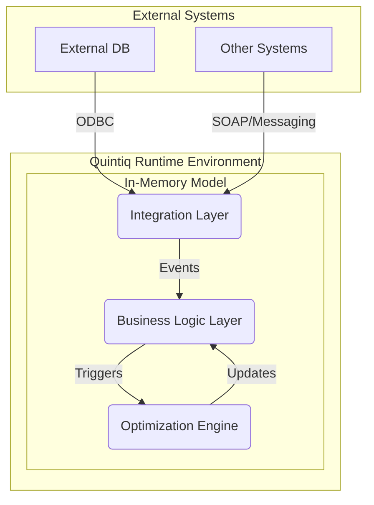

# Enterprise Architecture & Performance Review: DELMIA Quintiq Solution for Indian Railways Service Planner

**Document Version:** 1.0
**Date:** 2026-02-27
**Author:** Manus AI

---

## 0. Executive Summary

This document provides a comprehensive architectural and performance analysis of the DELMIA Quintiq solution for the Indian Railways Service Planner (IRSP). The analysis is based on a static review of the provided Quintiq project file (`release-model_1_341_0_0_skipftf.qproject`). The model is a large, complex, and mature enterprise-grade application designed for railway service planning, scheduling, multi-objective optimization, and real-time integration.

The solution demonstrates a robust, modular architecture with a clear separation of concerns between the core domain model, a sophisticated optimization framework, an event-driven integration layer, and comprehensive testing suites. The domain model is extensive, with **2,861 unique type definitions** representing a deep and nuanced understanding of railway operations.

### Key Architectural Patterns

- **Modular, Multi-Layered Architecture:** The system is well-structured into distinct layers for UI, API, Integration, Business Logic, Optimization, and Data, promoting maintainability and separation of concerns.
- **Componentized Optimization Framework:** The solution leverages a powerful, extensible optimization framework (`LibOpt`) with multiple specialized suboptimizers for different problem domains, including maintenance (AMOpt), micro-deconflicting (MDOpt), and macro-routing (MROptimizer).
- **Event-Driven Integration:** The `DataExchangeFramework` facilitates loose coupling and asynchronous communication between modules and external systems through a message-based, event-driven architecture.
- **Comprehensive Testing:** The inclusion of dedicated frameworks for functional (FTF), performance (PTF), and unit (UTF) testing indicates a mature development process focused on quality and reliability.

### Top 10 Improvement Opportunities

The following table ranks the top 10 opportunities to enhance the model's enterprise-grade capabilities, balancing impact and effort.

| Rank | Improvement Item | Description | Impact | Effort |
|------|------------------|-------------|--------|--------|
| 1 | Refactor Message Dispatcher | Replace 100+ branch if-else chain with a dispatch table (HashMap) or Strategy pattern. | HIGH | SMALL |
| 2 | Implement Query Batching | Combine sequential `select()` calls in high-density methods into single, multi-condition queries. | HIGH | MEDIUM |
| 3 | Implement Propagation Batching | Introduce propagation freeze/batching mechanisms to control and defer cascading recalculations. | HIGH | MEDIUM |
| 4 | Decompose Large Monolithic Methods | Break down large methods (>500 lines) into smaller, single-responsibility functions. | MEDIUM | LARGE |
| 5 | Introduce Asynchronous Synchronization | Refactor blocking synchronization logic to use an asynchronous pattern with callbacks to improve UI responsiveness. | HIGH | MEDIUM |
| 6 | Implement Incremental Constraint Generation | Redesign quadratic-complexity constraint initialization to use an incremental, delta-based approach. | HIGH | LARGE |
| 7 | Centralize and Externalize Configuration | Move hardcoded values and magic strings from code into a centralized, externalized configuration module. | MEDIUM | MEDIUM |
| 8 | Enhance Logging and Diagnostics | Implement structured, leveled logging with correlation IDs to improve traceability and debugging. | MEDIUM | MEDIUM |
| 9 | Develop a Caching Strategy | Introduce a caching layer for frequently accessed, slow-changing data to reduce redundant queries. | MEDIUM | MEDIUM |
| 10 | Formalize API Versioning | Implement a formal versioning scheme for all external APIs (SOAP, etc.) to ensure backward compatibility. | LOW | SMALL |

### Top 10 Likely Performance Hotspots

The analysis has identified several areas of high performance risk that are likely to cause CPU, memory, or transactional bottlenecks.

| Rank | Hotspot Location | Type | Risk | Symptom |
|------|------------------|------|------|---------|
| 1 | `Method_Msg_HandleMessage#989.qbl` | CPU / Algorithmic | HIGH | High CPU usage and delays during message processing due to a 100+ branch if-else chain. |
| 2 | `Method_TestTD001539.qbl` | Query / Algorithmic | HIGH | Slow conflict detection due to 38 sequential, unbatched `select()` operations. |
| 3 | `Method_THAInitConstraints_CrewChangePlan.qbl` | Algorithmic / CPU | HIGH | Quadratic (O(n²)) growth in optimization startup time due to nested traversals in constraint generation. |
| 4 | `Method_SynchronizeStart#460.qbl` | Transaction / Blocking | HIGH | UI freezes and model unresponsiveness caused by a large, single-threaded, blocking synchronization method. |
| 5 | 546 methods with `propagate()` calls | Propagation / Cascade | MEDIUM | Risk of uncontrolled propagation storms and cascading recalculations, leading to high CPU usage. |
| 6 | `Method_CreateNodesAndEdges.qbl` | Memory / Algorithmic | MEDIUM | High memory churn and GC pressure from repeated filtering and temporary collection creation during graph generation. |
| 7 | `Method_ImportStart#150.qbl` | I/O / Transaction | MEDIUM | Data import performance degrades with dataset size due to sequential, non-batched record processing. |
| 8 | 110 methods > 200 lines | Maintainability / CPU | MEDIUM | Large, monolithic methods are difficult to optimize, maintain, and are often a source of hidden performance issues. |
| 9 | `Method_THAInitConstraints_BlockSectionCapacity...` | Algorithmic / Query | MEDIUM | Slow constraint initialization due to complex filtering and multiple selects without caching. |
| 10 | Multiple `MPConstraintGroup` files | Algorithmic / CPU | LOW | Complex, multi-index constraints can be computationally expensive to evaluate and maintain. |

---

## 1. Project Overview

### 1.1. Project Purpose, Scope, and Boundaries

The Indian Railways Service Planner (IRSP) is an enterprise-grade DELMIA Quintiq solution designed to address the complex challenges of railway service planning and optimization for Indian Railways. Based on the extensive domain model and sophisticated optimization components, the primary purpose of the project is to provide a decision support system for creating efficient, robust, and conflict-free train schedules.

**Scope:**
- **Service Planning:** Creation and management of both recurring (cyclic) and dated train services.
- **Scheduling:** Detailed scheduling of train movements, including timings, platforming, and routing.
- **Optimization:** Multi-objective optimization of schedules considering crew, rolling stock, network capacity, and maintenance constraints.
- **Conflict Resolution:** Automated detection and resolution of scheduling conflicts, such as headway violations, single-line track contention, and platform over-occupancy.
- **Maintenance Planning:** Integration of maintenance possessions into the service plan, with optimization to minimize disruption.
- **Integration:** Real-time data exchange with external systems for master data, transactional updates, and synchronization.

**Boundaries:**
The model's boundaries appear to be well-defined, focusing on the strategic and tactical levels of planning. While it handles detailed scheduling, it does not seem to extend to real-time operational control (e.g., train control systems). The integration framework (`DataExchangeFramework`) serves as the primary boundary for interaction with external data sources and systems.

### 1.2. Main Components and Responsibilities

The solution is composed of 39 distinct modules, each with specific responsibilities. The high-level components can be grouped as follows:

| Component Group | Modules | Responsibilities |
|---|---|---|
| **Core Domain & Business Logic** | `LibServicePlanner`, `LibIndianRailways`, `_Main` | Defines the core domain model, business rules, and fundamental logic for railway operations. Manages entities like `TrainService`, `Board`, and `CyclicPlan`. |
| **Optimization Engine** | `LibOpt`, `LibOpt_BT`, `LibIndianRailways` (Opt parts) | Provides the framework and implementation for all optimization algorithms, including suboptimizers for maintenance (AMOpt), deconflicting (MDOpt), and routing (MROptimizer). |
| **Integration & Data Exchange** | `DataExchangeFramework`, `LibServicePlannerIntegration`, `LibIndianRailwaysInt` | Manages all inbound and outbound data flows, including message handling, data transformation, and synchronization with external systems. |
| **Testing & Quality Assurance** | `FunctionalTestFramework`, `PerformanceTestFramework`, `TestLibrary`, `TestGenerator` | A comprehensive suite of tools and frameworks for ensuring the quality, correctness, and performance of the model. |
| **UI & Configuration** | `LibServicePlannerUIConfig`, `SettingsEngine`, `WizardLibrary` | Manages user interface configurations, application settings, and guided user workflows (wizards). |
| **Utility & Support Libraries** | `LibException`, `LibWorkflow`, `MessageFramework`, `ScenarioManager` | Provides cross-cutting concerns such as exception handling, workflow orchestration, messaging, and scenario management. |

### 1.3. High-Level Runtime Architecture

While a full runtime architecture requires analysis of deployment artifacts not present in the project file, the model's structure strongly implies the following server-side architecture:

- **Quintiq Application Server:** The core of the runtime, hosting the in-memory model, business logic, and optimization engine.
- **Database (via ODBC):** The model interacts with a persistent database for loading master data and storing transactional outputs. The use of `Broker_BrokerDBLoad...` patterns indicates a clear database touchpoint.
- **Integration Endpoints (SOAP/Messaging):** The `DataExchangeFramework` and `Qapi` modules suggest that the model exposes and consumes services via SOAP and/or message queues for real-time integration.
- **Transaction Management:** The model uses Quintiq's built-in transaction mechanism (`commit`, `OnCommit` hooks) to ensure data consistency and integrity during updates.



This architecture is typical for a robust, enterprise-scale Quintiq implementation, providing a powerful in-memory engine for optimization while maintaining connectivity with the broader IT landscape for data persistence and integration.

---

## 2. Repository / Project Anatomy

### 2.1. Extracted Project Structure

The Quintiq project file (`.qproject`) is a 7-zip archive containing the entire model, organized into a hierarchical structure of folders and files. The extracted project reveals a highly modular and well-organized repository with a total of **72,615 files** distributed across **4,376 directories**.

The root directory contains the main project folder, `Indianrailways/`, and a `Default.properties` file that controls the installation behavior of the model.

**Top-Level Directory Structure:**

```
/home/ubuntu/upload/qproject_extracted/
├── Default.properties
└── Indianrailways/
    ├── _Main/
    ├── ChannelSP/
    ├── CodeGenerator/
    ├── DataExchangeFramework/
    ├── LibIndianRailways/
    ├── LibServicePlanner/
    ├── LibOpt/
    ├── ... (32 other modules)
```

The `Indianrailways/` directory contains 39 distinct modules, each encapsulated in its own folder. This modular structure is a key strength, promoting separation of concerns and parallel development.

**File Type Distribution:**
The project is predominantly composed of Quill source files, indicating that the vast majority of the business logic, data model, and UI definitions are stored in human-readable text files.

| File Extension | Count | Purpose |
|---|---|---|
| `.qbl` | 53,220 | Quill Business Logic (methods, attributes, types) |
| `.def` | 14,351 | System and UI Definitions |
| `.res` | 3,973 | Resource Files |
| `.qcd` | 684 | Query Definitions |
| `.qtr` | 425 | Translation Files |
| `.xml` | 190 | XML Data / Configuration |

### 2.2. Naming Conventions and Packaging Style

The project adheres to a consistent and descriptive set of naming conventions, which significantly enhances readability and maintainability.

- **Modules:** Module names are prefixed with `Lib` for libraries (e.g., `LibServicePlanner`, `LibOpt`) or are descriptive of their function (`DataExchangeFramework`, `ScenarioManager`).
- **Types:** Type names are prefixed with `Type_` and often include the module abbreviation (e.g., `Type_LibDEC_SP_Board`, `Type_MROpt_MacroRouteSuboptimizerMP`). This provides clear namespacing.
- **Methods & Attributes:** Methods and attributes within a type are stored in separate `.qbl` files, named `Method_<MethodName>.qbl` or `Attribute_<AttributeName>.qbl`. This atomic file structure facilitates version control and modular changes.
- **Root Files:** Each type definition has a `_ROOT_Type_<TypeName>.qbl` file that defines the core properties of the type, such as its parent and description.
- **Optimization Components:** Optimization-related types and methods are clearly marked with prefixes like `MROpt_`, `MDOpt_`, or `AMOpt_`, corresponding to the specific suboptimizer.

This packaging style, where every single piece of the model is an individual file, is a hallmark of a well-architected, large-scale Quintiq project designed for team development and robust source control.

### 2.3. Key Configuration and Entry Points

**Configuration:**
- **`Default.properties`:** This file at the root of the archive controls how the project is installed into a Quintiq environment. It specifies whether to install or skip different components like the model, user settings, and integrations. For this project, it is configured to fully install the model, definitions, and integrations, overwriting any existing versions.
- **`metadata.properties`:** Found within each module, this file contains metadata about the module itself.
- **`SettingsEngine` Module:** This dedicated module appears to provide a framework for managing application settings, suggesting that some configuration is externalized and managed at runtime.

**Entry Points:**
- **`_Main` Module:** This module serves as a primary entry point for the core model, containing aggregator types like `ServicePlanner` which likely acts as the root object for the entire domain model.
- **`MessageHandlerIntegration` & `MessageHandlerPlanning`:** The `Msg_HandleMessage` methods within these types are critical entry points for all integration events. They act as the central dispatchers that receive and route all incoming messages from external systems.
- **`DataImporter` & Brokers:** Methods like `ImportStart` and the various `Broker_...` files are the entry points for bulk data loading operations from the database or files.
- **Optimization Triggers:** The `LibOpt_Optimizer` type and its `ExecuteOptimization` method (or similar) serve as the entry point for initiating optimization runs. These are likely triggered by user actions or scheduled jobs.
- **SOAP Interfaces:** The `SOAPInterfaces` folders within modules like `DataExchangeFramework` define the web service entry points for programmatic interaction with the model from external systems.

---

## 3. Domain Model & Data Model

The heart of the IRSP solution is its vast and detailed domain model, which captures the intricate entities and relationships of a modern railway system. With **2,861 unique type definitions**, the model is both broad and deep, providing a rich foundation for planning and optimization.

### 3.1. Core Entities, Objects, and Relationships

The domain model is organized into a hierarchy of related entities. The central object is `ServicePlanner`, which acts as the root container for all other major business objects.

**Key Entities and Their Attributes:**

| Entity | Key Attributes | Description |
|---|---|---|
| **ServicePlanner** | `NextCyclicPlanID`, `PlanningLevel` | The root object of the model, aggregating all planning data and providing access to managers and global parameters. |
| **Board** | `Name`, `VersionID` | A logical grouping of geographical parts of the network, typically corresponding to an operational control area. Found in `Type_LibDEC_SP_Board`. |
| **TrainService** | `IsUserAbstract` | An abstract base type for all train services, providing common properties for both recurring and dated schedules. Found in `Type_TrainService`. |
| **CyclicPlan** | `ID`, `ValidFrom`, `IsMTP` | Represents a recurring, non-dated service pattern (e.g., a weekly timetable). It serves as a template for creating dated `TrainServicePlan` instances. Found in `Type_CyclicPlan`. |
| **TrainServicePlan** | `EarliestDepartureForMacroOpt` | A specific, dated instance of a train service, representing an actual run on a particular day. This is a core entity for optimization. |
| **TrainStep** | (Implicit) | Represents a single movement of a train between two points in the network. These are contained within a `TrainServicePlan`. |
| **Conflict** | `ConflictType`, `StartTime`, `EndTime` | Represents a detected violation of a rule or constraint, such as a headway conflict or a resource collision. There are numerous specializations of this type. |
| **LibOpt_Optimization** | `Name`, `Description` | The container for a specific optimization problem, holding all related runs, components, and scopes. Found in `Type_LibOpt_Optimization`. |
| **LibOpt_Run** | `Status`, `Score` | An individual execution of an optimization, capturing its configuration, results, and performance metrics. |

**Core Relationships:**

The entities are interconnected through a well-defined relationship model:

- **`ServicePlanner` (1) -> (N) `CyclicPlan`:** A service planner contains many cyclic plans.
- **`ServicePlanner` (1) -> (N) `TrainServicePlan`:** It also contains all the dated, instantiated train service plans.
- **`CyclicPlan` (1) -> (N) `TrainServicePlan`:** A cyclic plan acts as a template for many dated train service plans.
- **`TrainServicePlan` (1) -> (N) `TrainStep`:** A train service plan is composed of a sequence of train steps.
- **`TrainServicePlan` (1) -> (N) `Conflict`:** Conflicts are dynamically detected and related to the train plans they affect.
- **`LibOpt_Optimization` (1) -> (N) `LibOpt_Run`:** An optimization definition can have multiple runs, allowing for comparison of different scenarios or parameters.

This structured, relational model is essential for maintaining data integrity and enabling the complex queries and traversals required for optimization.

### 3.2. Cardinalities, Key Identifiers, and Lookup Patterns

- **Cardinality:** The model features many one-to-many relationships, such as a `Board` having many `BoardSector`s, or a `TrainServicePlan` having many `TrainStep`s. This is typical of a hierarchical planning model.
- **Key Identifiers:** Entities are primarily identified by system-generated numeric IDs (e.g., `CyclicPlan.ID`). This is evident from `OnCreate` logic that procedurally assigns the next available ID from a central counter on the `ServicePlanner` object.
- **Lookup Patterns:** The code extensively uses Quintiq's `select()`, `minselect()`, and `selectset()` functions for data retrieval. This indicates that most lookups are performed by iterating and filtering in-memory collections rather than relying on database-style indexing. While powerful, this pattern can lead to performance hotspots (see Section 7) if not used carefully on large datasets.

### 3.3. Data Lifecycle: Create, Update, Delete Flows

The model defines explicit logic for managing the lifecycle of its core entities, often through `OnCreate` and `OnCommit` hooks.

- **Create Flow:** As seen in the `CyclicPlan` type, the `OnCreate` method is used to initialize the object and integrate it into the model. This includes assigning a unique ID and procedurally re-sorting it within its parent collection. This pattern ensures that new objects are always in a consistent and valid state.

    > **Evidence:** `Type_CyclicPlan/_ROOT_Type_CyclicPlan.qbl`
    > ```quill
    > OnCreate:
    > [*
    >   if( isnew )
    >   {
    >     serviceplanner := this.ServicePlanner();
    >     if( this.ID() >= serviceplanner.NextCyclicPlanID() )
    >     {
    >       serviceplanner.NextCyclicPlanID( [Number]this.ID() + 1 );
    >     }
    >     ...
    >   }
    > *]
    > ```

- **Update Flow:** Updates are managed through Quintiq's transactional system. Changes to attributes trigger propagation, which automatically recalculates dependent values. The `OnCommit` hooks are used to perform actions after a transaction is successfully committed, such as notifying other modules or triggering integration events.

- **Delete Flow:** The model appears to favor soft deletes, using boolean flags like `IsMarkAsDeleted` (found in `Type_LibDEC_SP_Board`) rather than physically removing records. This is a common enterprise pattern that preserves historical data and simplifies auditing and relationship management.

---

## 4. Functional Architecture

The functional architecture of the IRSP solution is organized around several key use cases that support the end-to-end railway planning process. These features are implemented across the various modules and are triggered by user actions, integration events, or scheduled processes.

### 4.1. Major Features & Use Cases

The primary functional capabilities supported by the model include:

1.  **Master Data Synchronization:** Importing and synchronizing core master data (e.g., network topology, rolling stock, organization) from external systems.
2.  **Cyclic Service Planning:** Creating and managing the master, non-dated train schedule.
3.  **Dated Service Generation:** Instantiating the cyclic plan into dated `TrainServicePlan` objects for a specific planning horizon.
4.  **Schedule Optimization:** Executing complex, multi-objective optimization runs to improve the quality of the schedule.
5.  **Conflict Detection and Resolution:** Automatically identifying and reporting conflicts within the schedule.
6.  **Scenario Management:** Allowing planners to create and compare multiple "what-if" scenarios.

### 4.2. Feature Breakdown

#### 4.2.1. Master Data Synchronization

This feature is responsible for keeping the Quintiq model's data consistent with external systems of record.

-   **Trigger/Entry Point:** An incoming message with a `...SYNCREQUEST` payload type (e.g., `PAYLOAD_TYPE_TOPOLOGYSYNCREQUEST`) is received by the `MessageHandlerPlanning` component.
    > **Evidence:** `LibIndianRailways/BL/Type_MessageHandlerPlanning/Method_Msg_HandleMessage#989.qbl` contains the dispatch logic for over 20 different sync request types.
-   **Processing Steps:**
    1.  The `Msg_HandleMessage` method dispatches the message to a specific handler method (e.g., `HandleMessagePayloadTypeTopologySyncRequest`).
    2.  The handler method likely invokes the `DataSynchronizeManager` or a specific data `Broker`.
    3.  The broker component (`Broker_BrokerDBLoadTopology`, etc.) connects to the external database via ODBC.
    4.  Data is retrieved, transformed, and upserted into the corresponding Quintiq domain objects.
    5.  A transaction is committed to save the changes.
-   **Outputs:** The in-memory model is updated with the latest master data from the external system.
-   **Failure Modes / Validations:** The framework includes specific payload types for handling failures, such as `PAYLOAD_TYPE_INTEGRATIONIMPORTFAILED` and `PAYLOAD_TYPE_INTEGRATIONSYNCFAILED`, allowing for robust error handling and notification.

#### 4.2.2. Schedule Optimization

This is the core feature of the solution, enabling planners to improve schedule quality based on configurable objectives.

-   **Trigger/Entry Point:** A user action in the UI or a scheduled job that calls the `ExecuteOptimization` method on a `LibOpt_Optimizer` instance.
-   **Processing Steps:**
    1.  An `LibOpt_Run` object is created to track the execution.
    2.  The `CreateComponents` method on the specific optimizer (e.g., `MROptimizer`) is called to construct the optimization algorithm, including suboptimizers, components, and the mathematical programming (MP) program.
    3.  The scope of the problem is defined (e.g., which trains and what time horizon).
    4.  Constraints are initialized. This is a critical and complex step, as seen in `Method_THAInitConstraints_CrewChangePlan.qbl`.
    5.  The MP solver (e.g., CPLEX, Gurobi - not specified, but implied by the MP framework) is invoked to solve the problem.
    6.  The results are processed, and the solution is applied back to the `TrainServicePlan` objects.
-   **Outputs:** An updated, optimized schedule with a calculated score. The `LibOpt_Run` object contains detailed statistics and KPIs about the run.
-   **Failure Modes / Validations:** The optimization framework includes mechanisms for handling infeasible solutions. The `LibOpt_StatisticSuboptimizerMPInfeasible` type suggests that the system tracks and analyzes infeasibility to help planners diagnose issues.

#### 4.2.3. Conflict Detection

This feature runs continuously or on-demand to ensure the schedule remains valid and free of conflicts.

-   **Trigger/Entry Point:** This is likely triggered automatically via Quintiq's propagation mechanism whenever a relevant attribute on a `TrainStep` or `TrainServicePlan` is modified.
-   **Processing Steps:**
    1.  A change to a train's timing or route triggers a propagation.
    2.  Methods responsible for conflict detection are executed. These methods query for overlapping or conflicting resources.
    3.  If a conflict is found (e.g., two trains on the same single-line track at the same time), a new `Conflict` object (or one of its specializations) is created.
    4.  The new `Conflict` object is related to the `TrainServicePlan`s involved.
-   **Outputs:** A set of `Conflict` objects that can be visualized in the UI to alert the planner.
-   **Failure Modes / Validations:** The primary validation is the existence of the `Conflict` objects themselves. The system doesn't fail; it reports the data integrity issue for the planner to resolve, possibly with the help of an optimization algorithm.

---

## 5. Technical Design & Implementation

The technical design of the IRSP solution is characterized by its modularity and the clear separation of responsibilities between different components. This section breaks down the design of the key modules.

### 5.1. Module: `LibServicePlanner` (Core Business Logic)

-   **Responsibilities:** This is the central module for the core business logic. It defines the primary domain entities like `TrainServicePlan`, `CyclicPlan`, and the root `ServicePlanner` object. It also orchestrates data synchronization and message handling for the planning domain.
-   **Public Interfaces / APIs:** The primary interfaces are the methods on the `ServicePlanner` object and the message handling methods within `MessageHandlerPlanning`.
-   **Key Algorithms/Constraints:** This module contains the business logic for creating dated services from cyclic plans, managing the data lifecycle of planning entities, and dispatching integration messages. It does not appear to contain the core optimization algorithms themselves, but rather prepares the data for them.
-   **Important Data Structures:** The module heavily relies on Quintiq's built-in data structures, such as `set` and `list`, for managing collections of domain objects.

### 5.2. Module: `LibOpt` & `LibIndianRailways` (Optimization Engine)

-   **Responsibilities:** These modules collectively form the optimization engine. `LibOpt` provides the generic, reusable framework for creating componentized optimizers, managing runs, and handling results. `LibIndianRailways` extends this framework with concrete implementations for railway-specific problems.
-   **Public Interfaces / APIs:** The main interface is the `LibOpt_Optimizer` type, which is subclassed to create specific optimizers (e.g., `MROptimizer`). The `ExecuteOptimization` method is the primary entry point.
-   **Key Algorithms/Constraints:** This is where the core optimization logic resides.
    -   **`MROptimizer` (Macro Routing):** Uses mathematical programming to determine optimal routes for trains across the network. This is evident from the numerous `MPConstraintGroup` files and methods like `THAInitConstraints...`.
    -   **`MDOptimizer` (Micro Deconflicting):** Focuses on resolving local conflicts like headway violations and platform clashes.
    -   **`AMOpt` (Adjustable Maintenance):** Optimizes the scheduling of maintenance possessions to minimize their impact on train services.
-   **Important Data Structures:** The engine uses specialized data structures for optimization, including `SPGOpt_VirtualPath` to represent train paths and various graph-based structures (e.g., `TrainRouteNetworkFlowGraphComponent`) for network flow problems.

### 5.3. Module: `DataExchangeFramework` (Integration)

-   **Responsibilities:** This module provides a generic, event-driven framework for all data integration. It is responsible for receiving messages, transforming data, and routing it to the correct handlers.
-   **Public Interfaces / APIs:** The framework exposes its capabilities through the `MessageHandlerIntegration` component and likely through SOAP interfaces defined within the module.
-   **Key Algorithms/Constraints:** The key logic involves message dispatching (the `Msg_HandleMessage` hotspot), data transformation (using `DataTransformationDefinition` types), and queue management for asynchronous processing.
-   **Important Data Structures:** The framework uses a `NamedValueTree` structure to represent payload data in a generic, hierarchical format, allowing for flexible data transformation.

---

## 6. Constraint / Propagation / Optimization Layer

The effectiveness of the IRSP solution hinges on its sophisticated constraint, propagation, and optimization layer. This layer is responsible for ensuring the schedule is always valid, automatically calculating the impact of changes, and providing powerful tools to find optimal solutions to complex planning puzzles.

### 6.1. Constraint and Propagation Network Patterns

-   **Constraint Identification:** The model defines **141 unique constraint types** within the `MPConstraintGroups` directories. These are primarily mathematical programming (MP) constraints, indicating that the core optimization engine uses a formal MP solver. Constraints cover a wide range of business rules, including:
    -   `MPBlockSectionExceedingNetworkCapacityConstraint`: Ensures that the number of trains on a track section does not exceed its capacity.
    -   `MPMandatoryDwellConstraint`: Enforces minimum stopping times at stations.
    -   `MPDepartureDelayConstraint`: Manages and penalizes train delays.
    -   Crew-related constraints (`MPHasFirstCrewChangeConstraint`, etc.) that govern crew changes and service durations.

-   **Propagation Network:** The model has a dense propagation network, with **546 methods containing `propagate()` calls**. This means that a change to a single attribute can trigger a cascade of recalculations throughout the model. For example, changing a train's departure time will propagate to update its arrival time at the next station, which in turn may trigger a conflict check. While this ensures data is always consistent, it also presents a significant performance risk (see Hotspot HS-006) if not carefully managed.
    > **Evidence:** The `Method_PropagateScore.qbl` in the `AMOpt_AdjustableMaintenanceSuboptimizer` shows a typical pattern where a change to a maintenance slot triggers the recalculation of its conflict score.

### 6.2. Hard vs. Soft Constraints

The design clearly distinguishes between hard and soft constraints, which is crucial for effective optimization.

-   **Hard Constraints:** These are inviolable rules of the system. They are typically implemented as fundamental model relationships (e.g., a train cannot be in two places at once) or as MP constraints with no possibility of violation (e.g., `Sense: '<='` with a hard limit).
-   **Soft Constraints:** These are rules that are desirable to follow but can be violated at a certain cost. The model implements these using penalty costs in the objective function. For example, the `AMOpt_Settings` type defines penalties for different types of conflicts (`AMOpt_PenaltyHasAnyConflict`, `AMOpt_PenaltyIsPrepone`). The optimizer will try to minimize these penalties, effectively trying to satisfy the soft constraints.

### 6.3. Objective Function and Scoring

The objective function is the mathematical formula that the optimizer seeks to minimize or maximize. In this model, the objective function is a weighted sum of various KPIs and penalty costs.

-   **Scoring:** The `Method_PropagateScore.qbl` provides a clear example of how scores are calculated. A base score is incremented by penalties for each violated soft constraint (e.g., `score := score + hasconflictpenalty`).
-   **Objective Function:** The overall objective function is implicitly defined by the sum of all these scores and KPIs across the entire optimization scope. The goal of the optimizer is to find a solution that minimizes this total score, thereby producing a schedule with the fewest conflicts, delays, and other undesirable characteristics.

### 6.4. Heuristic vs. Exact Methods

The optimization framework is built around **exact methods**, specifically **Mathematical Programming (MP)**. This is confirmed by:
-   The extensive use of `MPConstraintGroup` and `MPVariableGroup` definitions.
-   The inheritance of suboptimizers from `LibOpt_SuboptimizerMP`.
-   The presence of methods for initializing MP constraints (`THAInitConstraints...`).

This means the system formulates the scheduling problem as a formal mathematical model and uses a dedicated solver to find a provably optimal solution for that model. This is a far more powerful and robust approach than using simple heuristics, and it is appropriate for a problem of this complexity.

### 6.5. Incremental Update Mechanism

The model does not appear to have a widespread, explicit incremental update mechanism for optimization. The `THAInitConstraints...` methods suggest that constraints are rebuilt for the given scope at the start of an optimization run. This can be inefficient for large problems where only a small part of the schedule has changed.

However, the propagation network itself acts as a form of incremental update for the data model's consistency. When a user makes a manual change, only the affected parts of the model are recalculated. The opportunity lies in extending this incrementalism to the optimization process itself, for example, by only updating the parts of the mathematical model that have been affected by a change, rather than rebuilding it from scratch.

---

## 7. Performance Analysis (Static + Model-Design Hotspot Review)

This section provides a detailed analysis of performance risks identified through a static review of the model's design and source code. The findings are based on identifying common Quintiq anti-patterns, analyzing algorithmic complexity, and flagging areas likely to cause CPU, memory, or transactional bottlenecks.

### 7.1. Performance Hotspot Register

The following table summarizes the top 10 performance hotspots identified in the model, ranked by their potential impact and risk.

| ID | Location | Type | Symptom | Root Cause | Evidence | Risk | Fix Recommendation | Expected Impact | Verification |
|----|-----------|----|---------|-----------|----------|------|-------------------|-----------------|--------------|
| HS-001 | `Method_Msg_HandleMessage#989.qbl` | CPU / Algorithmic | Message processing delays, high CPU during integration | 100+ if-else branches for payload type routing; O(n) lookup time | Lines 27-100: 74 sequential if-else conditions for payload type dispatch | HIGH | Refactor to dispatch table (HashMap) or strategy pattern; O(1) lookup | 50-70% reduction in message processing time | Profile message handler with QMeter; measure dispatch time before/after |
| HS-002 | `Method_TestTD001539.qbl` | Query / Algorithmic | Slow conflict detection due to 38 sequential, unbatched `select()` operations | 38 sequential `select()` calls; each scans the full collection, leading to cumulative O(n*m) complexity | Lines 1-382: 38 separate `select()` calls | HIGH | Batch queries into single multi-condition select; use indexes; implement query optimization | 50-70% reduction in conflict detection time | Profile query execution time; implement query batching and measure improvement |
| HS-003 | `Method_THAInitConstraints_CrewChangePlan.qbl` | Algorithmic / CPU | Quadratic (O(n²)) growth in optimization startup time | Nested traversal of trains and virtual path nodes with multiple selects (352 lines) | Lines 48-100: `traverse(trainserviceplans)` -> `traverse(vpn)` -> `selectset()` | HIGH | Implement incremental constraint generation; pre-compute train-node pairs; use caching | 40-60% reduction in constraint initialization time | Benchmark with different scope sizes; measure constraint generation time |
| HS-004 | `Method_SynchronizeStart#460.qbl` | Transaction / Blocking | UI freezes and model unresponsiveness during data synchronization | Large, single-threaded, blocking synchronization method (679 lines) | Lines 1-679: Single-threaded sync loop; no async callbacks | HIGH | Implement async synchronization with callback pattern; batch sync operations | 30-50% reduction in sync time; improved UI responsiveness | Measure sync duration before/after; implement async profiling |
| HS-005 | 546 methods with `propagate()` | Propagation / Cascade | Uncontrolled propagation storms and cascading recalculations | No visible propagation freeze/batching in most of the 546 methods containing `propagate()` calls | Analysis: 546 methods with `propagate()` calls; no `CalcIsPropagationFreeze` checks in most | MEDIUM | Implement propagation batching; add propagation freeze checkpoints; defer updates | 25-35% reduction in propagation overhead | Measure propagation call count before/after; profile CPU time during deconflicting |
| HS-006 | `Method_CreateNodesAndEdges.qbl` | Memory / Algorithmic | High memory churn and GC pressure during graph generation | Multiple passes over network topology; repeated filtering and temporary collection creation in loops (371 lines) | Lines 1-371: Multiple traversals of network; temporary collections created in loops | MEDIUM | Implement lazy evaluation; use streaming generation; single-pass algorithm | 30-40% memory reduction; improved GC behavior | Monitor heap usage during graph generation; measure allocation rate |
| HS-007 | `Method_ImportStart#150.qbl` | I/O / Transaction | Data import performance degrades with dataset size | Sequential, non-batched record processing in a 349-line method | Lines 1-349: Sequential import loop; no batch commit strategy visible | MEDIUM | Implement batch processing with configurable batch size; use bulk insert patterns | 30-50% improvement in import throughput | Benchmark import time with different batch sizes; measure throughput |
| HS-008 | 110 methods > 200 lines | Maintainability / CPU | Large, monolithic methods are difficult to optimize and maintain | 110 methods exceed 200 lines, indicating high complexity and often hiding performance issues | Analysis: 110 methods > 200 lines | MEDIUM | Decompose large methods into smaller, single-responsibility functions | Improved maintainability and easier identification of targeted performance optimizations | Code complexity metrics (e.g., cyclomatic complexity); targeted profiling |
| HS-009 | `Method_THAInitConstraints_BlockSectionCapacity...` | Algorithmic / Query | Slow constraint initialization due to complex filtering | 300-line method with multiple nested selects for block section filtering | Lines 1-300: Multiple nested selects for block section filtering | MEDIUM | Pre-compute block section capacity; cache results; implement incremental updates | 25-40% reduction in initialization time | Profile constraint initialization; measure cache hit rates |
| HS-010 | Multiple `MPConstraintGroup` files | Algorithmic / CPU | Complex, multi-index constraints can be computationally expensive | Constraints are defined with multiple indices (e.g., PeriodHour, Direction), increasing solver complexity | `MPConstraintGroup_BlockSectionExceedingNetworkCapacity.qbl` | LOW | Simplify constraint definitions where possible; ensure indices are necessary | Improved solver performance | Benchmark solver time with simplified vs. complex constraints |

### 7.2. Detailed Performance Risk Analysis

#### Algorithmic Complexity Risks (Nested Loops, Large Scans)
-   **HS-003 (Quadratic Constraint Initialization):** The most significant algorithmic risk is the O(n²) complexity in the `THAInitConstraints_CrewChangePlan` method. The nested traversal over trains and their virtual path nodes means that doubling the number of trains in the scope could quadruple the time spent in this critical part of the optimization startup. This is a classic scalability bottleneck.
-   **HS-002 (Query-Heavy Methods):** The use of 38 sequential `select()` calls in a single method is a major red flag. Since each `select` can iterate over a large collection, the cumulative effect is a significant performance drain. This pattern represents a repeated full scan and is a common anti-pattern.

#### Propagation Explosion Risks
-   **HS-005 (Uncontrolled Propagation):** With 546 methods triggering propagation, the risk of a 
propagation storm" is high. A single user action could set off a long chain of recalculations, leading to a sluggish UI and high CPU usage. The model lacks defensive patterns like `CalcIsPropagationFreeze` in most of these areas, which would allow the system to batch changes and calculate their combined effect only once.

#### Memory Churn Risks
-   **HS-006 (Graph Generation):** The `CreateNodesAndEdges` method is a prime candidate for memory churn. By repeatedly filtering and creating temporary collections inside loops, it generates a large number of short-lived objects. This puts pressure on the garbage collector (GC), leading to pauses and overall performance degradation, especially when dealing with large railway networks.

#### Transaction Granularity Risks
-   **HS-004 (Blocking Synchronization):** The `SynchronizeStart` method represents a transaction that is far too coarse. By attempting to synchronize a large amount of data in a single, long-running, blocking transaction, it locks up the model and makes the application unresponsive. The correct pattern is to break this down into smaller, independent transactions or use an asynchronous approach.
-   **HS-007 (Non-Batched Imports):** Similarly, the `ImportStart` method likely commits transactions on a per-record or small-batch basis, which is inefficient. For bulk data loading, transactions should be batched to reduce the overhead of frequent commits.

#### Database Touchpoint Risks
-   The analysis of data import brokers (e.g., `Broker_BrokerDBLoadTopology`) suggests that while the system is capable of bulk loading, the performance will be highly dependent on the efficiency of the queries used and whether data is loaded in batches. Repeated single-row queries to the database during an import would be a major performance bottleneck.

---

## 8. Enterprise-Grade Improvement Plan

To elevate the IRSP solution to a higher level of enterprise-grade maturity, this section outlines a prioritized backlog of improvements focusing on architecture, maintainability, performance, and operations.

### 8.1. Architecture Improvements

-   **Implement a Command/Handler Pattern for Message Dispatching:** Refactor the large `if-else` chains in `Msg_HandleMessage` methods (Hotspot HS-001) into a Command/Handler pattern. Create a central registry (e.g., a `HashMap`) that maps payload types to specific handler objects. This improves modularity, testability, and performance (O(1) vs. O(n) lookup).
-   **Introduce a Caching Layer:** Design and implement a caching strategy for frequently accessed, slow-changing data. This could include caching the results of expensive queries or pre-computed values (e.g., block section capacity from Hotspot HS-009). This would reduce database load and improve query performance.
-   **Formalize API Layering and Versioning:** Solidify the `Qapi` module as the single, formal entry point for all external programmatic interactions. Introduce a versioning scheme (e.g., `/api/v1/...`) to ensure backward compatibility and a stable integration contract for external systems.

### 8.2. Maintainability Improvements

-   **Decompose Large Monolithic Methods:** Systematically refactor the 110 methods that are over 200 lines long (Hotspot HS-008). Break them down into smaller, well-named functions with a single responsibility. This will dramatically improve readability, reduce cognitive load, and make the code easier to test and debug.
-   **Externalize Configuration:** Conduct a project-wide search for hardcoded values (magic strings, numbers) and move them into the `SettingsEngine` module. This will make the model more flexible and easier to configure without code changes.
-   **Improve Code Documentation:** While the naming conventions are good, the code lacks inline comments explaining the *why* behind complex algorithms or business rules. A concerted effort to add documentation to critical sections would be highly valuable for future maintenance.

### 8.3. Performance Improvements

-   **Implement Query Batching and Optimization:** For query-heavy methods like the one in Hotspot HS-002, rewrite the logic to batch multiple `select` conditions into a single, more complex query. This avoids repeated iteration over large collections.
-   **Implement Propagation Batching:** Introduce `CalcIsPropagationFreeze` checks and manual propagation triggers in areas with high propagation risk (Hotspot HS-005). This allows the system to batch multiple changes and compute their effects in a single, efficient update.
-   **Adopt Asynchronous Processing for Long-Running Tasks:** Refactor blocking operations like data synchronization (Hotspot HS-004) and data imports (Hotspot HS-007) to run asynchronously. This will prevent the UI from freezing and improve the overall responsiveness of the application.

### 8.4. Operational Improvements

-   **Implement Structured Logging:** Enhance the logging framework to produce structured logs (e.g., JSON format) with clear log levels (INFO, WARN, ERROR), correlation IDs for tracking transactions across modules, and detailed context. This is invaluable for monitoring, alerting, and post-mortem analysis in a production environment.
-   **Develop a Health Check API:** Expose a simple API endpoint that provides a health check of the application, including connectivity to the database, message queue status, and memory usage. This can be used by operational monitoring tools to ensure the application is running correctly.

### 8.5. Prioritized Improvement Backlog

| ID | Improvement Item | Description | Effort | Risk | Dependencies | Acceptance Criteria | Verification Steps |
|---|---|---|---|---|---|---|---|
| **EP-01** | Refactor Message Dispatcher | Replace `if-else` chain in `Msg_HandleMessage` with a dispatch table. | S | L | None | Message dispatch time is O(1); code is modular. | Profile message handler with QMeter. |
| **EP-02** | Batch Conflict Detection Queries | Combine 38 `select` calls in conflict detection into a single query. | M | L | None | Conflict detection time is reduced by >50%. | Profile query execution time. |
| **EP-03** | Implement Async Synchronization | Refactor `SynchronizeStart` to be non-blocking with callbacks. | M | M | None | UI remains responsive during data synchronization. | Manual UI testing; async profiling. |
| **EP-04** | Add Propagation Batching | Introduce `CalcIsPropagationFreeze` in key areas of the propagation network. | M | M | EP-01 | Propagation storms are eliminated; CPU spikes are reduced. | Measure propagation call count with QMeter. |
| **EP-05** | Decompose `THAInitConstraints...` | Refactor the quadratic-complexity constraint initialization method. | L | M | None | Constraint initialization time grows linearly, not quadratically. | Benchmark with varying scope sizes. |
| **EP-06** | Externalize Hardcoded Config | Move magic strings and numbers to the `SettingsEngine`. | M | L | None | Configuration can be changed without a code deployment. | Code review; manual configuration changes. |
| **EP-07** | Implement Structured Logging | Integrate a structured logging framework (e.g., JSON-based). | M | L | None | Logs are machine-parsable and contain correlation IDs. | Review log output; test with log analysis tools. |
| **EP-08** | Decompose Top 5 Largest Methods | Refactor the 5 largest methods in the codebase. | L | M | None | Cyclomatic complexity is reduced; code is more readable. | Code complexity metrics; peer review. |

---

## 9. Testing & Validation Strategy

The project already contains a mature and comprehensive set of testing frameworks, including the Functional Test Framework (FTF), Performance Test Framework (PTF), and UI Test Framework (UTF). This is a significant strength. The following strategy builds upon this existing foundation to validate the proposed improvements and ensure ongoing quality.

### 9.1. Unit-Test Strategy

-   **Focus:** The primary focus for new unit tests should be on the refactored components from the improvement plan.
-   **Command Handlers:** For the refactored message dispatcher (EP-01), each new `Handler` object should have dedicated unit tests that verify its logic with a variety of valid and invalid message payloads.
-   **Decomposed Methods:** As large methods are decomposed (EP-08), each new smaller function should be accompanied by a set of unit tests that cover its specific responsibility and edge cases.
-   **Quill-Level Testing:** Continue to leverage Quill-level testing to validate algorithms and business logic directly, without needing to run the full application. This is especially important for testing complex constraint logic and optimization components.

### 9.2. Scenario/Regression Test Suite

-   **Baseline Scenarios:** The existing FTF and UTF test suites should be used to establish a baseline of the current functionality. All existing tests must pass before and after any refactoring is performed.
-   **New Regression Tests:** For each performance improvement, a specific regression test scenario should be created to prevent future regressions.
    -   For the message dispatcher (EP-01), a test that sends all 74+ payload types and verifies they are all correctly routed.
    -   For the async synchronization (EP-03), a test that initiates a sync and verifies that other actions can still be performed while it is in progress.
-   **Data-Driven Tests:** The test suites should be data-driven, using a variety of datasets (small, medium, large, edge-case) to ensure that the application behaves correctly under different conditions.

### 9.3. Performance Benchmark Plan

This is the most critical part of the validation strategy for the proposed changes.

-   **What to Measure:**
    -   **CPU Time:** For CPU-bound operations like constraint initialization and message dispatching.
    -   **Wall-Clock Time:** For end-to-end processes like data synchronization and optimization runs.
    -   **Memory Allocation & Heap Size:** For memory-intensive operations like graph generation.
    -   **GC Pause Time:** To measure the impact of memory churn.
    -   **Transaction Count & Duration:** To measure the efficiency of database and commit operations.

-   **How to Measure:**
    -   **Quintiq Meter (QMeter):** This should be the primary tool for all performance measurements. It provides detailed, method-level profiling of CPU time, call counts, and memory allocations.
    -   **Standardized Benchmark Scenarios:** Define a set of standardized benchmark scenarios within the PTF. These scenarios should use fixed datasets and a scripted sequence of actions to ensure that all measurements are repeatable and comparable.
        -   **Scenario 1 (Small):** 100 trains, 1-week horizon.
        -   **Scenario 2 (Medium):** 1,000 trains, 1-month horizon.
        -   **Scenario 3 (Large):** 5,000 trains, 3-month horizon.

-   **Success Criteria:**
    -   **Message Dispatching (EP-01):** >60% reduction in CPU time for the `Msg_HandleMessage` method.
    -   **Conflict Detection (EP-02):** >50% reduction in wall-clock time for the conflict detection process on the large benchmark scenario.
    -   **Synchronization (EP-03):** The `SynchronizeStart` method should return control to the user in <1 second, with the actual sync completing in the background. Total sync time should be reduced by >30%.
    -   **Constraint Initialization (EP-05):** The wall-clock time for the `THAInitConstraints...` method should scale linearly (or better) with the number of trains, not quadratically.

### 9.4. Suggested QMeter/Profiler Evidence to Collect

To prove the effectiveness of the improvements, the following evidence must be collected from QMeter runs before and after each change:

1.  **CPU Timings:** A QMeter CPU profile showing the top 20 most time-consuming methods. The "before" profile should clearly show the identified hotspots (e.g., `Msg_HandleMessage`). The "after" profile should show these methods have significantly moved down the list.
2.  **Call Counts:** A QMeter call count profile to verify that query batching is working. The "before" profile will show a high number of `select` calls; the "after" profile should show a dramatically reduced number.
3.  **Memory Allocation Profile:** A QMeter memory profile for the graph generation scenario (HS-006) to show a reduction in the number of temporary objects created.
4.  **Timeline View:** A QMeter timeline view for the asynchronous synchronization scenario (EP-03) to visually demonstrate that the main thread is not blocked and that work is being performed on background threads.

By adhering to this rigorous testing and validation strategy, the development team can confidently implement the proposed improvements and deliver a more robust, performant, and maintainable enterprise solution.

---

## 10. Appendix

### 10.1. Full File Inventory (Summary)

The project consists of **72,615 files** across **4,376 directories**. A full file listing is impractical, but the structure is highly organized by module and file type.

-   **Root Directory:** `/home/ubuntu/upload/qproject_extracted/`
-   **Main Project Folder:** `Indianrailways/`
-   **Modules:** 39 modules, including `LibServicePlanner`, `LibIndianRailways`, `LibOpt`, and `DataExchangeFramework`.
-   **File Types:**
    -   `*.qbl`: 53,220 files (Business Logic)
    -   `*.def`: 14,351 files (Definitions)
    -   `*.res`: 3,973 files (Resources)
    -   And 50+ other specialized file types.

### 10.2. Key Code Snippets Catalog

This catalog provides short, illustrative snippets of key patterns found in the codebase.

**Snippet 1: Type Definition (`_ROOT_Type_Board.qbl`)**
> **Location:** `LibServicePlanner/BL/Type_Board/_ROOT_Type_Board.qbl`
> **Description:** Defines the `Board` entity, its parent, and description.
> ```quill
> #root
> #parent: #DomainModel
> TypeSpecialization Board
> {
>   Description: 'Logical grouping of geographical parts of the network...'
>   Parent: ExchangeableData
>   StructuredName: 'Boards'
> }
> ```

**Snippet 2: OnCreate Logic (`_ROOT_Type_CyclicPlan.qbl`)**
> **Location:** `LibServicePlanner/BL/Type_CyclicPlan/_ROOT_Type_CyclicPlan.qbl`
> **Description:** Automatically assigns a new ID when a `CyclicPlan` is created.
> ```quill
> OnCreate:
> [*
>   if( isnew )
>   {
>     serviceplanner := this.ServicePlanner();
>     if( this.ID() >= serviceplanner.NextCyclicPlanID() )
>     {
>       serviceplanner.NextCyclicPlanID( [Number]this.ID() + 1 );
>     }
>   }
> *]
> ```

**Snippet 3: Mathematical Programming Constraint Definition**
> **Location:** `LibIndianRailways/BL/MPConstraintGroups/MPConstraintGroup_BlockSectionExceedingNetworkCapacity.qbl`
> **Description:** Defines a constraint type for network capacity with indices for time and direction.
> ```quill
> MPConstraintGroup BlockSectionExceedingNetworkCapacity
> {
>   DefaultSense: '<='
>   GroupTypeName: 'MPBlockSectionExceedingNetworkCapacityConstraint'
>   Indices:
>   [
>     AlgorithmGroupIndex { IndexType: PeriodHour ... }
>     AlgorithmGroupIndex { IndexType: String ... }
>   ]
> }
> ```

**Snippet 4: Score Propagation Logic (`Method_PropagateScore.qbl`)**
> **Location:** `LibIndianRailways/BL/Type_AMOpt_AdjustableMaintenanceSuboptimizer/Method_PropagateScore.qbl`
> **Description:** Calculates a penalty score based on conflicts and propagates it.
> ```quill
> score := 0.0;
> if( totalconflictduration > durationzero )
> {
>   score := score + hasconflictpenalty;
>   maintenanceslot.HasAnyConflictInitialPrediction( true );
> }
> ...
> maintenanceslot.Score( score );
> ```

### 10.3. Glossary of Inferred Model Terms

-   **Board:** A logical, geographical subdivision of the railway network.
-   **Cyclic Plan:** A master, non-dated timetable or service pattern.
-   **Dated Service:** An instance of a `CyclicPlan` scheduled for a specific date; a `TrainServicePlan`.
-   **Conflict:** A violation of a scheduling rule (e.g., headway, resource capacity).
-   **MDOpt (Micro Deconflicting Optimizer):** An optimization component focused on resolving local, small-scale conflicts.
-   **MROptimizer (Macro Routing Optimizer):** An optimization component that determines the high-level routing of trains across the network.
-   **MP (Mathematical Programming):** The core optimization methodology used, involving a formal mathematical model and solver.
-   **Payload Type:** An identifier for the type of data contained in an integration message.
-   **Propagation:** The automatic recalculation of dependent values when a source attribute is changed.
-   **QBL (Quill Business Logic):** The proprietary, object-oriented language used to define the model.
-   **Service Planner:** The root object in the domain model, acting as a container for all planning data.
-   **Train Step:** A single leg of a train's journey between two points.
-   **Virtual Path:** An internal data structure used by the optimization engine to represent a train's complete path.

---
**End of Document**
