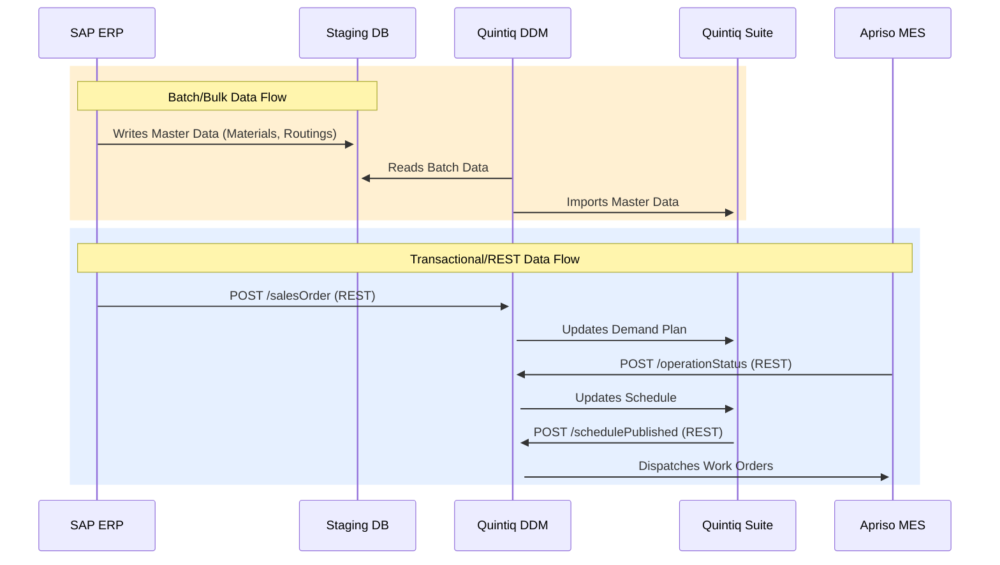
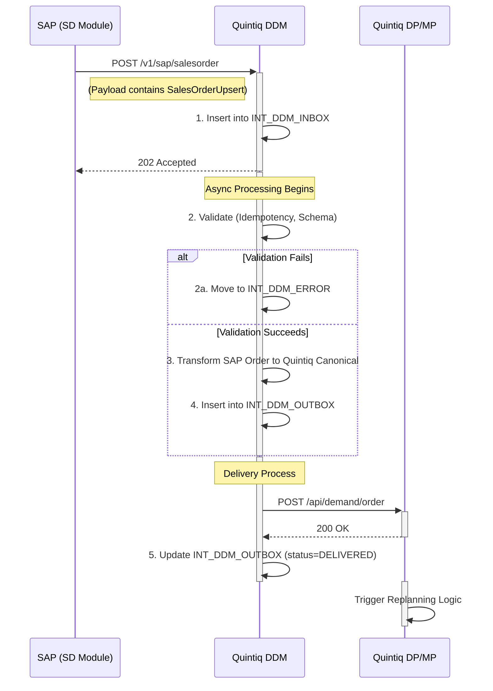
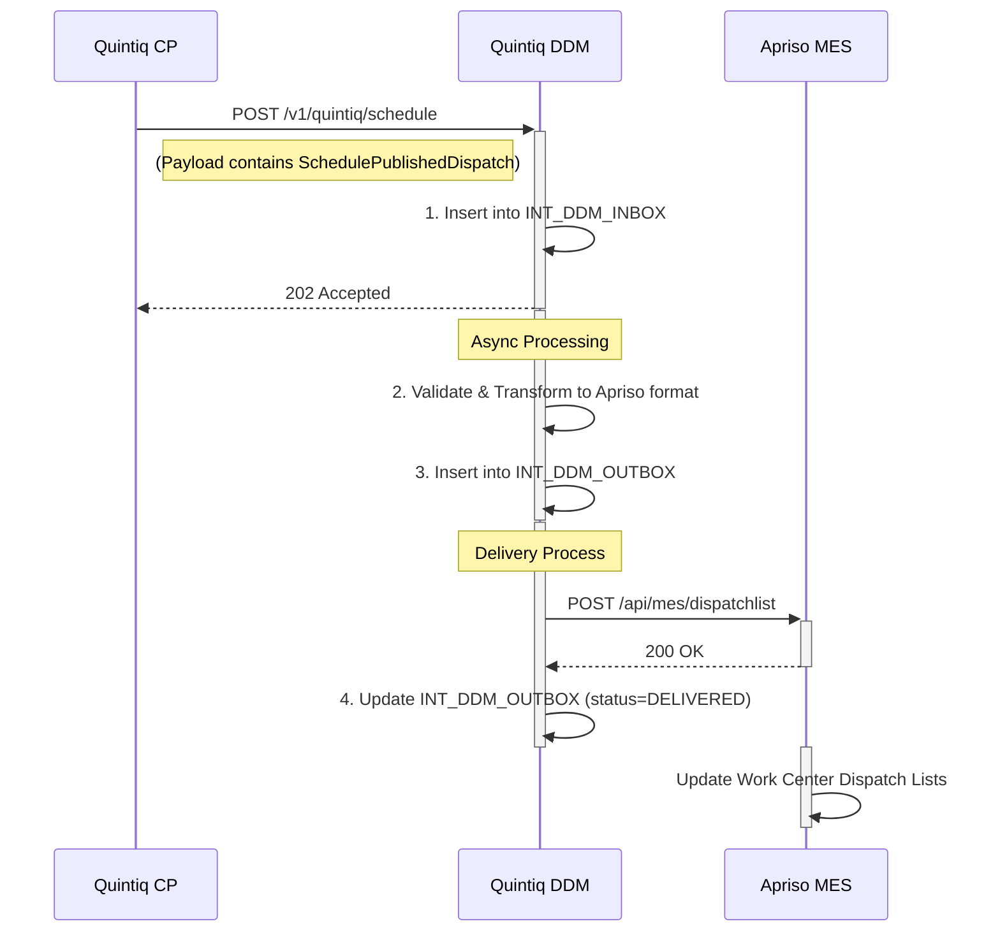
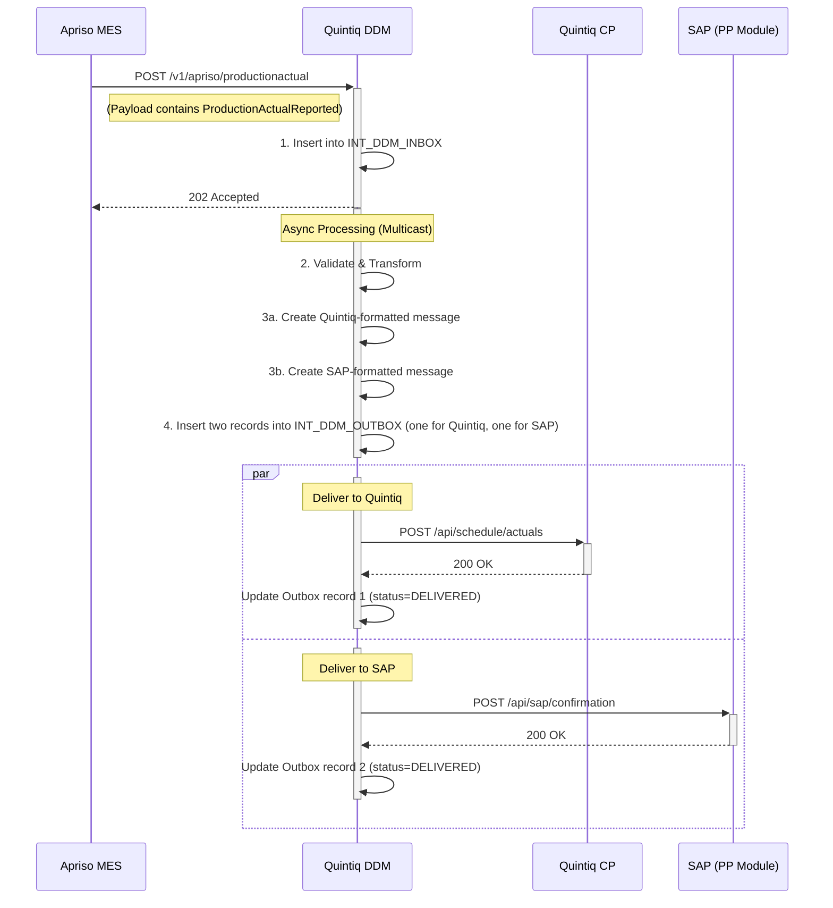
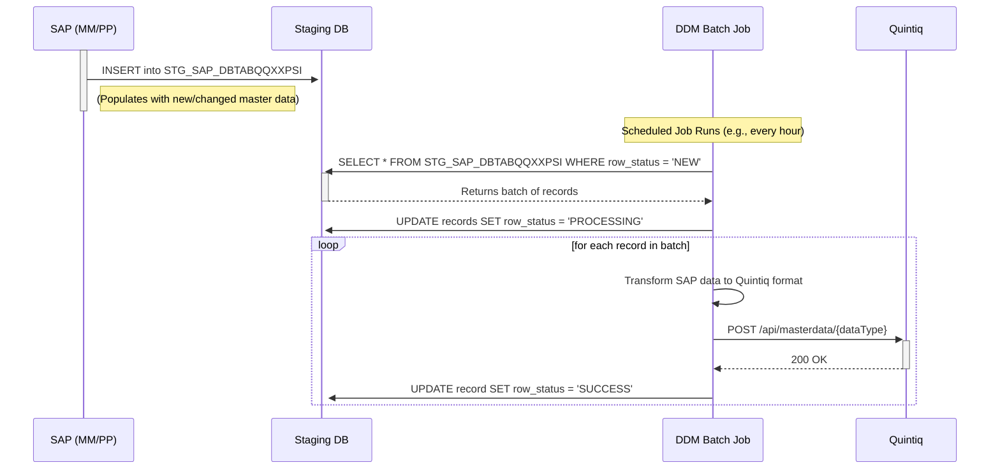
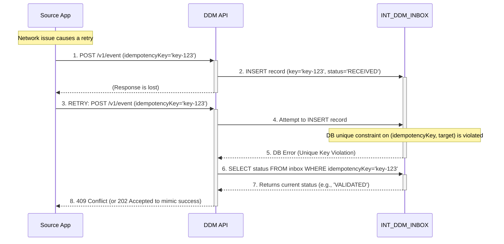

# No-Middleware SAP↔DDM↔Quintiq↔DDM↔MES Integration Design

**Version**: 1.0

**Date**: 2026-02-18

**Author**: Manus AI

## 1. Executive Summary

This document provides a comprehensive, implementation-ready integration design for connecting SAP S/4HANA, the DELMIA Quintiq suite, and the DELMIA Apriso MES within the ASSAN manufacturing landscape. The architecture explicitly forbids the use of traditional middleware platforms (ESB, iPaaS, Message Brokers) and instead establishes the Quintiq Data Distribution Manager (DDM) as the central component for all data transformation, routing, and reliability patterns.

The core principle of this design is to achieve robust, auditable, and maintainable integration through direct, point-to-point connections, leveraging either REST APIs for transactional data or a staging database for bulk/batch data flows. DDM acts as a lightweight, stateless transformation and routing engine, ensuring data consistency and providing essential reliability mechanisms such as idempotency, retries, and a centralized audit trail. This "no-middleware" approach reduces licensing costs, simplifies the technology stack, and places data ownership and governance squarely within the domain-specific applications.

### Key Design Decisions & Risks

| Decision                               | Rationale                                                                                             | Risk                                                                                               | Mitigation                                                                                                                               |
| -------------------------------------- | ----------------------------------------------------------------------------------------------------- | -------------------------------------------------------------------------------------------------- | ---------------------------------------------------------------------------------------------------------------------------------------- |
| **No Middleware (ESB/iPaaS/Broker)**   | Reduce TCO, avoid vendor lock-in, and simplify the technology stack.                                    | Increased development effort for reliability patterns (retries, idempotency) within DDM and endpoints. | Implement standardized inbox/outbox patterns in DDM; provide clear data contracts and libraries for endpoint developers.                   |
| **DDM as Central Transformer/Router**  | Centralize mapping logic and routing rules for consistency and maintainability.                       | DDM could become a single point of failure or a performance bottleneck.                            | Design DDM for high availability and stateless processing; implement robust monitoring, alerting, and horizontal scaling capabilities. |
| **Direct REST & Staging DB Flows**     | Use the right pattern for the right job: REST for low-latency transactional data, DB for efficient bulk data. | Requires disciplined adherence to data contracts and versioning to avoid tight coupling.             | Enforce strict schema validation in DDM; implement a formal contract change management and governance process.                               |
| **Idempotency via Deterministic Keys** | Prevent duplicate message processing and ensure data integrity during retries or replays.               | Requires careful key design and consistent implementation across all systems.                      | Define clear idempotency key rules for each data contract; implement automated testing to validate idempotency logic.                    |
| **Centralized Auditing in DDM**        | Provide a single, unified view of all data movements for traceability, troubleshooting, and compliance. | Audit log database could grow very large and become a performance issue.                           | Implement a data archiving and purging strategy for the audit database; use partitioned tables for efficient querying.                   |


## 2. Architecture Overview

### 2.1. Conceptual Architecture

The integration architecture is designed around a "hub-and-spoke" model with DDM at its center. All data exchanges between SAP, Quintiq, and Apriso are routed through DDM, which is responsible for transformation, validation, and routing. There are two primary communication patterns:

1.  **Transactional/Near-Real-Time**: Direct REST API calls are used for low-latency, event-driven data exchange. Systems call DDM's inbound APIs, and DDM, in turn, calls the target systems' APIs. This pattern is used for business-critical events like sales order changes or production status updates.
2.  **Batch/Bulk Data**: A shared staging database is used for efficient, high-volume transfer of master data and other less time-sensitive information. Source systems write data to dedicated schemas in the staging database, and a scheduled DDM process picks up, transforms, and delivers the data to the target systems.



*Figure 1: Conceptual Architecture Diagram*

### 2.2. Detailed Data Flow Narratives

#### 2.2.1. SAP → DDM → Quintiq Suite

-   **Master Data (Batch)**: SAP periodically extracts Material Masters, Customer Masters, and planning-level Routing/BOM releases into the `STG_SAP_DBTABQQXXPSI` schema in the staging database. A scheduled DDM job reads this data, transforms it into the Quintiq canonical format, and imports it into the relevant Quintiq applications (DP, MP, CP) using their respective APIs or import mechanisms.
-   **Transactional Data (REST)**: When a Sales Order is created or changed in SAP (SD module), an event triggers a direct REST API call to a DDM endpoint (e.g., `/v1/sap/salesorder`). DDM validates, transforms, and enriches the payload, then routes it to the appropriate Quintiq applications (DP, MP) to update the demand plan.

#### 2.2.2. Apriso → DDM → Quintiq Suite & SAP

-   **Execution Actuals (REST)**: As operations are performed on the shop floor, Apriso captures status changes (Start, Complete), production counts (Good, Scrap), and resource state changes. For each event, Apriso makes a REST call to a specific DDM endpoint (e.g., `/v1/apriso/operationstatus`). DDM validates the data, transforms it into the Quintiq canonical format, and calls the appropriate Quintiq APIs (CP, MC-SCH, CR-SCH) to provide near-real-time feedback to the schedule. If required, DDM can also route production confirmations back to SAP PP.

#### 2.2.3. Quintiq Suite → DDM → Apriso

-   **Schedule Publication (REST)**: Once a detailed schedule is finalized and published in Quintiq CP, an event triggers a REST call to DDM (e.g., `/v1/quintiq/schedule`). This payload contains the dispatch list of operations, their sequence, and planned start/end times for a specific work center. DDM transforms this into the Apriso work order format and calls the Apriso API to create or update the dispatch list for the shop floor operators.

#### 2.2.4. Quintiq Suite → DDM → SAP

-   **Planning Results (REST)**: After a planning run in Quintiq MP or CP, the system may generate planned order proposals or provide Available-to-Promise (ATP) results. This data is sent to DDM via a REST API call. DDM transforms the data into the required SAP format and calls the corresponding SAP API to create planned orders or update sales order confirmations in SAP.

### 2.3. What is NOT Allowed

To maintain the integrity of the "no-middleware" approach, the following patterns and functionalities are strictly forbidden:

-   **Message Brokering**: DDM must not function as a pub/sub message broker. All routing is explicit and point-to-point.
-   **Complex Event Processing (CEP)**: DDM will not perform stateful correlation of multiple events to derive a new business event.
-   **Business Process Orchestration**: Long-running business processes or multi-step sagas are not managed within DDM. All process logic resides within the source or target applications.
-   **Data Virtualization**: DDM is not a data virtualization layer. It only processes data that is explicitly sent to it.
-   **Undocumented or "Pass-Through" APIs**: Every integration flow must be fronted by a versioned and documented data contract in DDM.

## 3. System of Record (SoR) & Domain Ownership Matrix

Clear ownership of data is critical for maintaining data integrity. The following table defines the System of Record (SoR) for each key data domain.

| Data Domain                       | System of Record (SoR) | Key Consumers                               | Sync Mode    | Frequency/Latency | Criticality |
| --------------------------------- | ---------------------- | ------------------------------------------- | ------------ | ----------------- | ----------- |
| **Material Master**               | SAP (MM)               | Quintiq (DP, MP, CP), Apriso                | Batch        | Daily             | High        |
| **Customer Master**               | SAP (SD)               | Quintiq (DP, MP)                            | Batch        | Daily             | Medium      |
| **Sales Orders / Demand**         | SAP (SD)               | Quintiq (DP, MP)                            | REST         | Near-Real-Time    | High        |
| **Inventory Snapshot**            | SAP (MM)               | Quintiq (MP, CP)                            | Batch        | Hourly            | Medium      |
| **Routing/BOM (Planning)**        | SAP (PP)               | Quintiq (MP, CP)                            | Batch        | As Released       | High        |
| **Work Centers / Resources**      | SAP (PP) / Quintiq (CR-SCH) | Quintiq (CR-SCH), Apriso                    | Batch/REST   | Daily / Real-Time | High        |
| **Calendars / Shifts**            | Quintiq (CR-SCH)       | Apriso                                      | REST         | On Change         | High        |
| **Schedule / Dispatch Operations**| Quintiq (CP)           | Apriso                                      | REST         | On Publish        | High        |
| **Execution Actuals**             | Apriso                 | Quintiq (CP, MC-SCH, CR-SCH), SAP (PP)      | REST         | Near-Real-Time    | High        |
| **Scrap / Rework**                | Apriso                 | Quintiq (CP), SAP (PP)                      | REST         | Near-Real-Time    | High        |
| **Machine / Resource States**     | Apriso                 | Quintiq (MC-SCH, CR-SCH)                    | REST         | Near-Real-Time    | High        |
| **Quality Results**               | Apriso                 | SAP (QM)                                    | REST / Batch | Near-Real-Time    | Medium      |


## 4. Integration Patterns Without Middleware (Reliability)

To achieve enterprise-grade reliability without a dedicated middleware platform, a set of robust patterns will be implemented directly within DDM and the connecting applications. The core of this strategy is the **Inbox/Outbox pattern** implemented within DDM's own database schema.

### 4.1. Canonical Message Envelope

All data exchanged via REST APIs will be wrapped in a standard canonical envelope. This ensures consistency and provides the necessary metadata for routing, auditing, and reliability.

```json
{
  "schemaVersion": "1.0",
  "eventId": "f47ac10b-58cc-4372-a567-0e02b2c3d479",
  "eventType": "DemandSalesOrderUpsert",
  "occurredAt": "2026-02-18T10:00:00Z",
  "source": "SAP-S4H-PROD",
  "target": "Quintiq-DP-PROD",
  "correlationId": "SAP-ORD-12345",
  "idempotencyKey": "SAP-ORD-12345-V1",
  "payload": {
    "...": "..."
  }
}
```

*For a full definition, see Section 6: Canonical Message Envelope.*

### 4.2. DDM Inbox/Outbox Pattern

DDM will persist every incoming and outgoing message to a set of internal tables, enabling guaranteed delivery and state tracking.

1.  **Receiving a Message (Inbox)**:
    *   When a source system calls a DDM API, the first step is to insert the raw request (header + body) into the `INT_DDM_INBOX` table with a `RECEIVED` status.
    *   DDM immediately returns a `202 Accepted` HTTP response to the caller, acknowledging receipt. The processing now happens asynchronously.
    *   A background process in DDM picks up `RECEIVED` messages.
    *   **Idempotency Check**: It calculates the `idempotencyKey` and checks if it already exists in the inbox for the same target. If a duplicate is found, the message is marked `DUPLICATE` and processing stops.
    *   **Validation**: The message is validated against the registered JSON schema for its `eventType`. If it fails, it's moved to the `INT_DDM_ERROR` table with a `CONTRACT_VALIDATION` error code.
    *   If validation passes, the inbox record is marked `VALIDATED`.

2.  **Transforming and Sending (Outbox)**:
    *   Once a message is `VALIDATED`, the transformation logic is applied.
    *   The transformed payload is then inserted into the `INT_DDM_OUTBOX` table, one record for each target system, with a `PENDING_DELIVERY` status.
    *   A separate delivery process picks up `PENDING_DELIVERY` messages.
    *   It makes the REST API call to the target system.
    *   **On Success (HTTP 2xx)**: The outbox record is marked `DELIVERED`.
    *   **On Failure (HTTP 4xx/5xx or Timeout)**: The `retry_count` is incremented. The record is updated with the error details and scheduled for a later retry based on the backoff policy. If `max_retries` is exceeded, the message is moved to the `INT_DDM_ERROR` table (dead-letter queue).

```mermaid
sequenceDiagram
    participant SourceApp as Source App
    participant DDM_API as DDM API
    participant DDM_Inbox as INT_DDM_INBOX
    participant DDM_Outbox as INT_DDM_OUTBOX
    participant DDM_Error as INT_DDM_ERROR
    participant TargetApp as Target App

    SourceApp->>+DDM_API: POST /v1/some-event
    DDM_API->>+DDM_Inbox: INSERT (status=RECEIVED)
    DDM_API-->>-SourceApp: 202 Accepted

    Note over DDM_Inbox, DDM_Outbox: DDM Async Processing
    DDM_Inbox->>DDM_Inbox: Check Idempotency & Validate
    alt Validation Fails
        DDM_Inbox->>+DDM_Error: INSERT (error=VALIDATION_FAIL)
        DDM_Inbox->>DDM_Inbox: UPDATE (status=FAILED)
    else Validation Succeeds
        DDM_Inbox->>DDM_Inbox: UPDATE (status=VALIDATED)
        DDM_Inbox->>+DDM_Outbox: INSERT (status=PENDING_DELIVERY)
    end

    DDM_Outbox->>+TargetApp: POST /api/endpoint
    alt Delivery Fails & Retries Left
        TargetApp-->>-DDM_Outbox: 503 Service Unavailable
        DDM_Outbox->>DDM_Outbox: UPDATE (status=RETRY, retry_count++)
    else Delivery Succeeds
        TargetApp-->>-DDM_Outbox: 200 OK
        DDM_Outbox->>DDM_Outbox: UPDATE (status=DELIVERED)
    end
```
*Figure 2: Inbox/Outbox Reliability Pattern*

### 4.3. Idempotency Strategy

Idempotency is essential to prevent processing duplicate messages during network retries. It will be enforced by DDM's inbox.

-   **Key Generation**: The source system is responsible for generating a deterministic `idempotencyKey`. The rule for generating this key will be defined per data contract. Common patterns include:
    -   `{BusinessKey}` (e.g., `SAP-ORD-12345` for a sales order)
    -   `{BusinessKey}-{Version}` (e.g., `SAP-ORD-12345-V2` for the second version of an order)
    -   `{Source}-{MessageID}` (e.g., `SAP-MSG-GUID-123`)
-   **Enforcement**: DDM will enforce uniqueness on `(idempotencyKey, target)` within a configurable time window (e.g., 72 hours).

### 4.4. Retry & Circuit Breaker Policy

-   **Retry Policy**: For transient failures (e.g., HTTP 503, timeouts), DDM's outbox will automatically retry delivery.
    -   **Backoff Strategy**: Exponential backoff will be used (e.g., 1s, 5s, 30s, 1m, 5m).
    -   **Max Retries**: A configurable maximum number of retries (e.g., 10) will be defined per target system.
-   **Circuit Breaker**: If a target system consistently fails for a certain number of requests (e.g., 5 consecutive failures), DDM will trip a circuit breaker for that endpoint. All new messages for that target will be queued in the outbox but not attempted for a cooldown period (e.g., 5 minutes), preventing the source system from being overwhelmed.

### 4.5. Replay & Reprocess Flows

The `INT_DDM_ERROR` table acts as a dead-letter queue. It provides the ability to manually or automatically reprocess failed messages.

-   **Replay by ID**: An administrative API in DDM will allow authorized users to trigger a replay of a specific message by its `eventId` or `correlationId`.
-   **Reprocess from Error Queue**: Messages in the `INT_DDM_ERROR` table can be resubmitted into the processing pipeline. This is useful after a bug fix in the transformation logic or a configuration change.

## 5. DDM Capability Model

DDM is designed to be a lightweight, focused component. Its responsibilities are strictly defined to prevent it from evolving into a monolithic middleware.

| Capability          | IN SCOPE (DDM Does This)                                                                                             | OUT OF SCOPE (DDM Does NOT Do This)                                                                        |
| ------------------- | -------------------------------------------------------------------------------------------------------------------- | ---------------------------------------------------------------------------------------------------------- |
| **Transformation**  | - Schema mapping (e.g., SAP IDoc JSON to Quintiq REST JSON)<br>- Data format conversion (date, number)<br>- Code translation (via mapping tables) | - Complex business rule execution<br>- Calling external services for data enrichment                             |
| **Routing**         | - Content-based routing based on header/payload fields (e.g., `plantCode`)<br>- 1-to-1 and 1-to-many (multicast) routing | - Dynamic routing based on external state<br>- Pub/Sub topic-based routing                                |
| **Validation**      | - JSON Schema validation<br>- Mandatory field checks<br>- Referential integrity checks (via cached data or API calls) | - Cross-message business process validation                                                                |
| **Reliability**     | - Idempotency checks<br>- Guaranteed delivery via Inbox/Outbox<br>- Automated retries with backoff<br>- Circuit breaker pattern | - Distributed transaction coordination (Sagas)<br>- Business process compensation logic                    |
| **Observability**   | - Centralized audit log of all messages<br>- Correlation tracing via `correlationId`<br>- Dashboards for counts, errors, latency | - Business-level KPI monitoring                                                                            |
| **Configuration**   | - Endpoint registry<br>- Schema registry<br>- Retry policy configuration<br>- Credential management (via secure vault) | - Business workflow modeling                                                                               |

## 6. Canonical Message Envelope (STANDARD)

The canonical envelope is the single, immutable format for all event-driven communication. It provides the metadata necessary for DDM to perform its functions without needing to understand the deep business context of the payload.

### 6.1. JSON Definition

```json
{
  "$schema": "http://json-schema.org/draft-07/schema#",
  "title": "CanonicalIntegrationEvent",
  "description": "Standard envelope for all asynchronous integration events routed through DDM.",
  "type": "object",
  "properties": {
    "schemaVersion": {
      "description": "Version of the event payload schema. Format: Major.Minor (e.g., 1.0, 2.1).",
      "type": "string",
      "pattern": "^[0-9]+\\.[0-9]+$"
    },
    "eventId": {
      "description": "A unique UUID (v4) for this specific event instance.",
      "type": "string",
      "format": "uuid"
    },
    "eventType": {
      "description": "The specific type of event, corresponding to a registered data contract (e.g., DemandSalesOrderUpsert).",
      "type": "string"
    },
    "occurredAt": {
      "description": "The UTC timestamp (ISO 8601) of when the event occurred in the source system.",
      "type": "string",
      "format": "date-time"
    },
    "source": {
      "description": "The unique identifier of the source system instance (e.g., SAP-S4H-PROD).",
      "type": "string"
    },
    "target": {
      "description": "The intended primary target system. DDM may route to additional targets.",
      "type": "string"
    },
    "correlationId": {
      "description": "An ID that links related events in a business process (e.g., the SAP Sales Order number).",
      "type": "string"
    },
    "idempotencyKey": {
      "description": "A deterministic key generated by the source to prevent duplicate processing.",
      "type": "string"
    },
    "payload": {
      "description": "The business data object, which must conform to the schema defined by eventType and schemaVersion.",
      "type": "object"
    }
  },
  "required": [
    "schemaVersion",
    "eventId",
    "eventType",
    "occurredAt",
    "source",
    "correlationId",
    "idempotencyKey",
    "payload"
  ]
}
```

### 6.2. Field Explanations

-   **`schemaVersion`**: Governs the structure of the `payload`. DDM uses this to select the correct transformation map and validation schema.
-   **`eventId`**: The primary key for an event instance. Used for logging, tracing, and replay.
-   **`eventType`**: The "verb" of the event. It defines the business intent and maps directly to a data contract.
-   **`occurredAt`**: Crucial for sequencing and understanding the timeline of business events.
-   **`source` / `target`**: Used for routing, monitoring, and access control.
-   **`correlationId`**: The thread that connects different steps of a business process across multiple systems.
-   **`idempotencyKey`**: The mechanism for preventing duplicate processing, as detailed in the reliability patterns.
-   **`payload`**: The actual business data, decoupled from the integration metadata.

### 6.3. Versioning Strategy

-   **Minor Version (e.g., 1.0 → 1.1)**: Non-breaking changes. Typically involves adding new, optional fields to the payload. Consumers should be able to ignore fields they don't understand. DDM can handle these changes with minimal impact.
-   **Major Version (e.g., 1.1 → 2.0)**: Breaking changes. This includes removing fields, renaming fields, or changing the data type of a field. A new `eventType` (e.g., `DemandSalesOrderUpsert_v2`) or a new major version in the URL (`/v2/salesorder`) is required. DDM will need a new transformation map, and consumers must be updated to handle the new contract.


## 7. Data Contract Pack (Version 1.0)

This section provides the detailed, versioned data contracts for each integration point. Each contract serves as a binding agreement between the producer, DDM, and the consumer.

---

### 7.1. Contract: DemandSalesOrderUpsert

-   **Contract Name**: `DemandSalesOrderUpsert`
-   **Version**: `1.0`
-   **Direction**: `SAP (SD) → DDM → Quintiq (DP, MP)`
-   **Trigger/Event**: Triggered when a Sales Order is created, updated, or cancelled in SAP.
-   **Frequency/Latency Class**: Near-Real-Time (target < 5 seconds end-to-end).
-   **Business Keys**: `salesOrderNumber`, `salesOrderItemNumber`
-   **Referential Constraints**: `materialNumber` must exist in Quintiq Material Master. `customerNumber` must exist in Quintiq Customer Master.
-   **IdempotencyKey Rule**: `{salesOrderNumber}-{salesOrderItemNumber}-{timestamp}` where timestamp is the last modification time from SAP.
-   **Error Codes on Failure**: `CONTRACT_VALIDATION`, `KEY_NOT_FOUND` (if material/customer lookup fails), `TARGET_TIMEOUT`.

#### Fields

| Field Name             | Type      | Required | Description                                                                 |
| ---------------------- | --------- | -------- | --------------------------------------------------------------------------- |
| `salesOrderNumber`     | `string`  | Yes      | The unique identifier for the sales order in SAP.                           |
| `salesOrderItemNumber` | `string`  | Yes      | The line item number within the sales order.                                |
| `orderType`            | `string`  | Yes      | The type of sales order (e.g., 'OR' for Standard Order).                    |
| `actionType`           | `string`  | Yes      | The action being performed: `CREATE`, `UPDATE`, `CANCEL`.                   |
| `customerNumber`       | `string`  | Yes      | The SAP customer number.                                                    |
| `materialNumber`       | `string`  | Yes      | The SAP material (product) number.                                          |
| `quantity`             | `number`  | Yes      | The quantity of the material ordered.                                       |
| `unitOfMeasure`        | `string`  | Yes      | The unit of measure for the quantity (e.g., 'EA', 'KG').                    |
| `requestedDeliveryDate`| `string`  | Yes      | The customer's requested delivery date in ISO 8601 format.                  |
| `plant`                | `string`  | Yes      | The manufacturing plant code (e.g., 'PLANT001').                            |
| `priority`             | `number`  | No       | The priority of the order, if specified.                                    |

#### Example JSON Payload

```json
{
  "schemaVersion": "1.0",
  "eventId": "a1b2c3d4-e5f6-4a7b-8c9d-0e1f2a3b4c5d",
  "eventType": "DemandSalesOrderUpsert",
  "occurredAt": "2026-02-18T11:30:00Z",
  "source": "SAP-S4H-PROD",
  "target": "Quintiq-DP-PROD",
  "correlationId": "SO-75000123",
  "idempotencyKey": "SO-75000123-10-20260218112955",
  "payload": {
    "salesOrderNumber": "75000123",
    "salesOrderItemNumber": "10",
    "orderType": "OR",
    "actionType": "CREATE",
    "customerNumber": "CUST-1005",
    "materialNumber": "MAT-FIN-001",
    "quantity": 250,
    "unitOfMeasure": "EA",
    "requestedDeliveryDate": "2026-03-15",
    "plant": "PLANT001",
    "priority": 1
  }
}
```

#### Validation Rules

1.  `actionType` must be one of `CREATE`, `UPDATE`, `CANCEL`.
2.  If `actionType` is `CANCEL`, `quantity` should be 0.
3.  `requestedDeliveryDate` must be a valid date and not in the past.
4.  `plant` must be a valid and active plant code.


---

### 7.2. Contract: CustomerMasterUpsert

-   **Contract Name**: `CustomerMasterUpsert`
-   **Version**: `1.0`
-   **Direction**: `SAP (SD) → DDM → Quintiq (DP, MP)`
-   **Trigger/Event**: Creation or update of a customer in SAP.
-   **Frequency/Latency Class**: Batch (Daily).
-   **Business Keys**: `customerNumber`
-   **IdempotencyKey Rule**: `{customerNumber}-{timestamp}`
-   **Error Codes on Failure**: `CONTRACT_VALIDATION`.

#### Fields

| Field Name       | Type     | Required | Description                                      |
| ---------------- | -------- | -------- | ------------------------------------------------ |
| `customerNumber` | `string` | Yes      | The unique identifier for the customer in SAP.   |
| `customerName`   | `string` | Yes      | The legal name of the customer.                  |
| `address`        | `object` | Yes      | The primary address of the customer.             |
| `address.street` | `string` | Yes      | Street name and number.                          |
| `address.city`   | `string` | Yes      | City.                                            |
| `address.postalCode`| `string`| Yes      | Postal code.                                     |
| `address.country`| `string` | Yes      | Country code (ISO 3166-1 alpha-2).               |
| `contactEmail`   | `string` | No       | Primary email contact for the customer.          |

#### Example JSON Payload

```json
{
  "schemaVersion": "1.0",
  "eventId": "b2c3d4e5-f6a7-4b8c-9d0e-1f2a3b4c5d6e",
  "eventType": "CustomerMasterUpsert",
  "occurredAt": "2026-02-18T04:00:00Z",
  "source": "SAP-S4H-PROD",
  "target": "Quintiq-DP-PROD",
  "correlationId": "CUST-1005",
  "idempotencyKey": "CUST-1005-20260218035901",
  "payload": {
    "customerNumber": "CUST-1005",
    "customerName": "Global Manufacturing Inc.",
    "address": {
      "street": "123 Industrial Ave",
      "city": "Metropolis",
      "postalCode": "12345",
      "country": "US"
    },
    "contactEmail": "purchasing@globalmfg.com"
  }
}
```

#### Validation Rules

1.  `customerNumber` must not be empty.
2.  `address.country` must be a valid ISO 3166-1 alpha-2 country code.
3.  `contactEmail` if provided, must be a valid email format.


---

### 7.3. Contract: MaterialMasterUpsert

-   **Contract Name**: `MaterialMasterUpsert`
-   **Version**: `1.0`
-   **Direction**: `SAP (MM) → DDM → Quintiq (DP, MP, CP), Apriso`
-   **Trigger/Event**: Creation or update of a material in SAP.
-   **Frequency/Latency Class**: Batch (Daily).
-   **Business Keys**: `materialNumber`
-   **IdempotencyKey Rule**: `{materialNumber}-{timestamp}`
-   **Error Codes on Failure**: `CONTRACT_VALIDATION`.

#### Fields

| Field Name          | Type     | Required | Description                                                                 |
| ------------------- | -------- | -------- | --------------------------------------------------------------------------- |
| `materialNumber`    | `string` | Yes      | The unique identifier for the material in SAP.                              |
| `description`       | `string` | Yes      | The short description of the material.                                      |
| `baseUnitOfMeasure` | `string` | Yes      | The base unit of measure for the material (e.g., 'EA', 'KG').               |
| `materialType`      | `string` | Yes      | The type of material (e.g., 'FERT' for finished good, 'ROH' for raw material).|
| `productHierarchy`  | `string` | No       | The product hierarchy code.                                                 |
| `isBatchManaged`    | `boolean`| Yes      | Indicates if the material is managed in batches.                            |

#### Example JSON Payload

```json
{
  "schemaVersion": "1.0",
  "eventId": "c3d4e5f6-a7b8-4c9d-0e1f-2a3b4c5d6e7f",
  "eventType": "MaterialMasterUpsert",
  "occurredAt": "2026-02-18T04:05:00Z",
  "source": "SAP-S4H-PROD",
  "target": "Quintiq-All-PROD",
  "correlationId": "MAT-FIN-001",
  "idempotencyKey": "MAT-FIN-001-20260218040411",
  "payload": {
    "materialNumber": "MAT-FIN-001",
    "description": "Finished Good Assembly 1",
    "baseUnitOfMeasure": "EA",
    "materialType": "FERT",
    "productHierarchy": "PH-001-A",
    "isBatchManaged": true
  }
}
```

#### Validation Rules

1.  `materialNumber` must not be empty.
2.  `baseUnitOfMeasure` must be a valid UoM code.
3.  `materialType` must be a valid material type code.


---

### 7.4. Contract: RoutingReleasePlanningUpsert

-   **Contract Name**: `RoutingReleasePlanningUpsert`
-   **Version**: `1.0`
-   **Direction**: `SAP (PP) → DDM → Quintiq (MP, CP)`
-   **Trigger/Event**: Release of a new or updated routing/BOM version in SAP for planning purposes.
-   **Frequency/Latency Class**: Batch (As Released).
-   **Business Keys**: `routingNumber`, `routingVersion`
-   **IdempotencyKey Rule**: `{routingNumber}-{routingVersion}`
-   **Error Codes on Failure**: `CONTRACT_VALIDATION`, `KEY_NOT_FOUND`.

#### Fields

| Field Name                  | Type      | Required | Description                                                                                             |
| --------------------------- | --------- | -------- | ------------------------------------------------------------------------------------------------------- |
| `routingNumber`             | `string`  | Yes      | The unique identifier for the routing.                                                                  |
| `routingVersion`            | `string`  | Yes      | The version of the routing being released.                                                              |
| `materialNumber`            | `string`  | Yes      | The finished good this routing produces.                                                                |
| `plant`                     | `string`  | Yes      | The plant where this routing is valid.                                                                  |
| `operations`                | `array`   | Yes      | An array of operation steps in the routing.                                                             |
| `operations.operationNumber`| `string`  | Yes      | The sequence number of the operation (e.g., '0010', '0020').                                            |
| `operations.workCenter`     | `string`  | Yes      | The work center where the operation is performed.                                                       |
| `operations.setupTime`      | `number`  | No       | The time required to set up the work center for this operation.                                         |
| `operations.processingTime` | `number`  | Yes      | The time required to process one unit of the material.                                                  |
| `operations.timeUnit`       | `string`  | Yes      | The unit of time for setup and processing (e.g., 'MIN', 'HR').                                          |
| `bomItems`                  | `array`   | Yes      | An array of Bill of Material items required for the main material.                                      |
| `bomItems.materialNumber`   | `string`  | Yes      | The component material number.                                                                          |
| `bomItems.quantity`         | `number`  | Yes      | The quantity of the component material required.                                                        |
| `bomItems.unitOfMeasure`    | `string`  | Yes      | The unit of measure for the component quantity.                                                         |

#### Example JSON Payload

```json
{
  "schemaVersion": "1.0",
  "eventId": "d4e5f6a7-b8c9-4d0e-1f2a-3b4c5d6e7f8g",
  "eventType": "RoutingReleasePlanningUpsert",
  "occurredAt": "2026-02-18T09:00:00Z",
  "source": "SAP-S4H-PROD",
  "target": "Quintiq-CP-PROD",
  "correlationId": "ROUT-MAT-FIN-001-V2",
  "idempotencyKey": "ROUT-MAT-FIN-001-V2",
  "payload": {
    "routingNumber": "ROUT-MAT-FIN-001",
    "routingVersion": "V2",
    "materialNumber": "MAT-FIN-001",
    "plant": "PLANT001",
    "operations": [
      {
        "operationNumber": "0010",
        "workCenter": "WC-ASM-01",
        "setupTime": 60,
        "processingTime": 5,
        "timeUnit": "MIN"
      },
      {
        "operationNumber": "0020",
        "workCenter": "WC-INSP-01",
        "setupTime": 15,
        "processingTime": 2,
        "timeUnit": "MIN"
      }
    ],
    "bomItems": [
      {
        "materialNumber": "MAT-RAW-A",
        "quantity": 2,
        "unitOfMeasure": "EA"
      },
      {
        "materialNumber": "MAT-RAW-B",
        "quantity": 5,
        "unitOfMeasure": "KG"
      }
    ]
  }
}
```

#### Validation Rules

1.  `operations` array must not be empty.
2.  `bomItems` array must not be empty.
3.  All `materialNumber`s in `bomItems` must exist in the Material Master.
4.  All `workCenter`s must exist in the Work Center Master.


---

### 7.5. Contract: InventorySnapshotUpsert

-   **Contract Name**: `InventorySnapshotUpsert`
-   **Version**: `1.0`
-   **Direction**: `SAP (MM) → DDM → Quintiq (MP, CP)`
-   **Trigger/Event**: Periodic snapshot of inventory levels from SAP.
-   **Frequency/Latency Class**: Batch (Hourly).
-   **Status**: **Optional**. This interface is only required if near-real-time inventory updates from transactional movements are not implemented or deemed insufficient for planning accuracy.
-   **Business Keys**: `snapshotId`
-   **IdempotencyKey Rule**: `{snapshotId}`
-   **Error Codes on Failure**: `CONTRACT_VALIDATION`.

#### Fields

| Field Name                 | Type      | Required | Description                                                                 |
| -------------------------- | --------- | -------- | --------------------------------------------------------------------------- |
| `snapshotId`               | `string`  | Yes      | A unique identifier for this snapshot batch (e.g., a UUID or timestamp-based ID). |
| `snapshotTimestamp`        | `string`  | Yes      | The UTC timestamp (ISO 8601) when the snapshot was taken.                     |
| `plant`                    | `string`  | Yes      | The plant for which this inventory snapshot is valid.                       |
| `inventoryItems`           | `array`   | Yes      | An array of inventory levels for various materials.                         |
| `inventoryItems.materialNumber` | `string`  | Yes      | The material number.                                                        |
| `inventoryItems.storageLocation`| `string`  | No       | The specific storage location within the plant.                             |
| `inventoryItems.unrestrictedStock`| `number`  | Yes      | The quantity of stock with no usage restrictions.                           |
| `inventoryItems.qualityInspectionStock`| `number`| Yes      | The quantity of stock currently under quality inspection.                   |
| `inventoryItems.blockedStock`| `number`  | Yes      | The quantity of stock that is blocked from use.                             |
| `inventoryItems.unitOfMeasure`| `string`  | Yes      | The unit of measure for the stock quantities.                               |

#### Example JSON Payload

```json
{
  "schemaVersion": "1.0",
  "eventId": "e5f6a7b8-c9d0-4e1f-2a3b-4c5d6e7f8g9h",
  "eventType": "InventorySnapshotUpsert",
  "occurredAt": "2026-02-18T12:00:00Z",
  "source": "SAP-S4H-PROD",
  "target": "Quintiq-MP-PROD",
  "correlationId": "INV-SNAP-20260218-1200",
  "idempotencyKey": "INV-SNAP-20260218-1200",
  "payload": {
    "snapshotId": "INV-SNAP-20260218-1200",
    "snapshotTimestamp": "2026-02-18T12:00:00Z",
    "plant": "PLANT001",
    "inventoryItems": [
      {
        "materialNumber": "MAT-RAW-A",
        "storageLocation": "SLOC-01",
        "unrestrictedStock": 1500,
        "qualityInspectionStock": 100,
        "blockedStock": 50,
        "unitOfMeasure": "EA"
      },
      {
        "materialNumber": "MAT-RAW-B",
        "storageLocation": "SLOC-02",
        "unrestrictedStock": 8500,
        "qualityInspectionStock": 0,
        "blockedStock": 200,
        "unitOfMeasure": "KG"
      }
    ]
  }
}
```

#### Validation Rules

1.  `snapshotId` must be unique for each snapshot.
2.  `inventoryItems` array must not be empty.
3.  All stock quantities must be zero or greater.
4.  All `materialNumber`s must exist in the Material Master.


---

### 7.6. Contract: OperationStatusChanged

-   **Contract Name**: `OperationStatusChanged`
-   **Version**: `1.0`
-   **Direction**: `Apriso → DDM → Quintiq (CP, MC-SCH, CR-SCH)`
-   **Trigger/Event**: An operator starts, pauses, or completes a manufacturing operation on the shop floor.
-   **Frequency/Latency Class**: Near-Real-Time (target < 15 seconds end-to-end).
-   **Business Keys**: `workOrderNumber`, `operationNumber`
-   **IdempotencyKey Rule**: `{workOrderNumber}-{operationNumber}-{status}-{timestamp}`
-   **Error Codes on Failure**: `CONTRACT_VALIDATION`, `KEY_NOT_FOUND` (if work order/operation lookup fails in Quintiq).

#### Fields

| Field Name          | Type     | Required | Description                                                                                              |
| ------------------- | -------- | -------- | -------------------------------------------------------------------------------------------------------- |
| `workOrderNumber`   | `string` | Yes      | The unique identifier for the work order being executed.                                                 |
| `operationNumber`   | `string` | Yes      | The specific operation within the work order.                                                            |
| `resourceId`        | `string` | Yes      | The ID of the machine or resource where the operation is being performed.                                |
| `status`            | `string` | Yes      | The new status of the operation: `STARTED`, `PAUSED`, `RESUMED`, `COMPLETED`.                            |
| `statusTimestamp`   | `string` | Yes      | The UTC timestamp (ISO 8601) when the status change occurred.                                            |
| `operatorId`        | `string` | No       | The ID of the operator who performed the action.                                                         |
| `reasonCode`        | `string` | No       | A reason code, especially for `PAUSED` status (e.g., `MATERIAL_UNAVAILABLE`, `MAINTENANCE`).             |

#### Example JSON Payload

```json
{
  "schemaVersion": "1.0",
  "eventId": "f6a7b8c9-d0e1-4f2a-3b4c-5d6e7f8g9h0i",
  "eventType": "OperationStatusChanged",
  "occurredAt": "2026-02-18T13:05:10Z",
  "source": "Apriso-MES-PROD",
  "target": "Quintiq-CP-PROD",
  "correlationId": "WO-10025-0010",
  "idempotencyKey": "WO-10025-0010-STARTED-20260218130510",
  "payload": {
    "workOrderNumber": "WO-10025",
    "operationNumber": "0010",
    "resourceId": "WC-ASM-01",
    "status": "STARTED",
    "statusTimestamp": "2026-02-18T13:05:10Z",
    "operatorId": "JDOE"
  }
}
```

#### Validation Rules

1.  `status` must be one of `STARTED`, `PAUSED`, `RESUMED`, `COMPLETED`.
2.  If `status` is `PAUSED`, `reasonCode` should ideally be provided.
3.  `statusTimestamp` must be a valid ISO 8601 timestamp.
4.  The combination of `workOrderNumber` and `operationNumber` must correspond to a dispatched operation in Quintiq.


---

### 7.7. Contract: ProductionActualReported

-   **Contract Name**: `ProductionActualReported`
-   **Version**: `1.0`
-   **Direction**: `Apriso → DDM → Quintiq (CP), SAP (PP)`
-   **Trigger/Event**: Reporting of production quantities (good, scrap, rework) for an operation.
-   **Frequency/Latency Class**: Near-Real-Time (target < 30 seconds end-to-end).
-   **Business Keys**: `workOrderNumber`, `operationNumber`, `reportingTimestamp`
-   **IdempotencyKey Rule**: `{workOrderNumber}-{operationNumber}-{reportingTimestamp}`
-   **Error Codes on Failure**: `CONTRACT_VALIDATION`, `KEY_NOT_FOUND`.

#### Fields

| Field Name           | Type     | Required | Description                                                                 |
| -------------------- | -------- | -------- | --------------------------------------------------------------------------- |
| `workOrderNumber`    | `string` | Yes      | The unique identifier for the work order.                                   |
| `operationNumber`    | `string` | Yes      | The specific operation within the work order.                               |
| `resourceId`         | `string` | Yes      | The ID of the resource where production was reported.                       |
| `goodQuantity`       | `number` | Yes      | The quantity of conforming material produced.                               |
| `scrapQuantity`      | `number` | Yes      | The quantity of non-conforming material produced.                           |
| `reworkQuantity`     | `number` | Yes      | The quantity of material that requires rework.                              |
| `unitOfMeasure`      | `string` | Yes      | The unit of measure for the quantities.                                     |
| `reportingTimestamp` | `string` | Yes      | The UTC timestamp (ISO 8601) when the production was reported.              |
| `scrapReasonCode`    | `string` | No       | A reason code for the scrapped quantity.                                    |

#### Example JSON Payload

```json
{
  "schemaVersion": "1.0",
  "eventId": "g7h8i9j0-k1l2-4m3n-4o5p-6q7r8s9t0u1v",
  "eventType": "ProductionActualReported",
  "occurredAt": "2026-02-18T14:00:00Z",
  "source": "Apriso-MES-PROD",
  "target": "Quintiq-CP-PROD",
  "correlationId": "WO-10025-0010",
  "idempotencyKey": "WO-10025-0010-20260218140000",
  "payload": {
    "workOrderNumber": "WO-10025",
    "operationNumber": "0010",
    "resourceId": "WC-ASM-01",
    "goodQuantity": 100,
    "scrapQuantity": 5,
    "reworkQuantity": 2,
    "unitOfMeasure": "EA",
    "reportingTimestamp": "2026-02-18T14:00:00Z",
    "scrapReasonCode": "DEFECT-A"
  }
}
```

#### Validation Rules

1.  All quantities must be zero or greater.
2.  `unitOfMeasure` must be a valid UoM code.
3.  The combination of `workOrderNumber` and `operationNumber` must correspond to a dispatched operation.


---

### 7.8. Contract: ResourceStateChanged

-   **Contract Name**: `ResourceStateChanged`
-   **Version**: `1.0`
-   **Direction**: `Apriso → DDM → Quintiq (MC-SCH, CR-SCH)`
-   **Trigger/Event**: The operational state of a machine or resource changes (e.g., goes down for maintenance).
-   **Frequency/Latency Class**: Near-Real-Time (target < 15 seconds end-to-end).
-   **Business Keys**: `resourceId`, `stateChangeTimestamp`
-   **IdempotencyKey Rule**: `{resourceId}-{state}-{stateChangeTimestamp}`
-   **Error Codes on Failure**: `CONTRACT_VALIDATION`, `KEY_NOT_FOUND` (if resource lookup fails).

#### Fields

| Field Name             | Type     | Required | Description                                                                                             |
| ---------------------- | -------- | -------- | ------------------------------------------------------------------------------------------------------- |
| `resourceId`           | `string` | Yes      | The unique identifier of the resource (machine, tool, etc.).                                            |
| `state`                | `string` | Yes      | The new state of the resource: `UP` (Running), `DOWN` (Unplanned Outage), `SCHEDULED_DOWN` (Maintenance). |
| `stateChangeTimestamp` | `string` | Yes      | The UTC timestamp (ISO 8601) when the state change occurred.                                            |
| `reasonCode`           | `string` | No       | A code explaining the reason for the state change, especially for `DOWN` states.                        |
| `expectedUpTimestamp`  | `string` | No       | For `SCHEDULED_DOWN`, the expected time the resource will be back online.                               |

#### Example JSON Payload

```json
{
  "schemaVersion": "1.0",
  "eventId": "h8i9j0k1-l2m3-4n4o-5p6q-7r8s9t0u1v2w",
  "eventType": "ResourceStateChanged",
  "occurredAt": "2026-02-18T15:10:00Z",
  "source": "Apriso-MES-PROD",
  "target": "Quintiq-MCSCH-PROD",
  "correlationId": "WC-ASM-01-STATE-CHANGE",
  "idempotencyKey": "WC-ASM-01-DOWN-20260218151000",
  "payload": {
    "resourceId": "WC-ASM-01",
    "state": "DOWN",
    "stateChangeTimestamp": "2026-02-18T15:10:00Z",
    "reasonCode": "UNPLANNED_TOOL_BREAKAGE"
  }
}
```

#### Validation Rules

1.  `state` must be one of `UP`, `DOWN`, `SCHEDULED_DOWN`.
2.  If `state` is `DOWN` or `SCHEDULED_DOWN`, `reasonCode` is highly recommended.
3.  `resourceId` must exist in the Quintiq resource master.


---

### 7.9. Contract: SchedulePublishedDispatch

-   **Contract Name**: `SchedulePublishedDispatch`
-   **Version**: `1.0`
-   **Direction**: `Quintiq (CP/OC/MC-SCH/CR-SCH) → DDM → Apriso`
-   **Trigger/Event**: A planner publishes a new schedule in Quintiq for a specific time horizon and set of resources.
-   **Frequency/Latency Class**: On Publish (target < 30 seconds end-to-end).
-   **Business Keys**: `publishId`
-   **IdempotencyKey Rule**: `{publishId}`
-   **Error Codes on Failure**: `CONTRACT_VALIDATION`, `TARGET_TIMEOUT`, `TARGET_5XX`.

#### Fields

| Field Name                        | Type      | Required | Description                                                                                              |
| --------------------------------- | --------- | -------- | -------------------------------------------------------------------------------------------------------- |
| `publishId`                       | `string`  | Yes      | A unique identifier for this specific schedule publication event.                                        |
| `plant`                           | `string`  | Yes      | The plant for which the schedule is being published.                                                     |
| `publishTimestamp`                | `string`  | Yes      | The UTC timestamp (ISO 8601) when the schedule was published.                                            |
| `dispatchList`                    | `array`   | Yes      | An array of operations to be dispatched to the shop floor.                                               |
| `dispatchList.workOrderNumber`    | `string`  | Yes      | The work order number.                                                                                   |
| `dispatchList.operationNumber`    | `string`  | Yes      | The operation number.                                                                                    |
| `dispatchList.materialNumber`     | `string`  | Yes      | The material to be produced.                                                                             |
| `dispatchList.quantity`           | `number`  | Yes      | The quantity to be produced.                                                                             |
| `dispatchList.resourceId`         | `string`  | Yes      | The primary resource assigned to perform the operation.                                                  |
| `dispatchList.plannedStart`       | `string`  | Yes      | The planned start time (ISO 8601) for the operation.                                                     |
| `dispatchList.plannedEnd`         | `string`  | Yes      | The planned end time (ISO 8601) for the operation.                                                       |
| `dispatchList.sequenceNumber`     | `number`  | Yes      | The sequence of this operation on the resource.                                                          |
| `dispatchList.ruleSetId`          | `string`  | No       | Reference to any specific Order Combiner (OC) rule set used.                                             |
| `dispatchList.maintenanceWindowRef`| `string` | No       | Reference to any maintenance window (from MC-SCH) affecting this operation's timing.                     |
| `dispatchList.calendarRef`        | `string`  | No       | Reference to the specific calendar (from CR-SCH) used for scheduling this operation.                     |

#### Example JSON Payload

```json
{
  "schemaVersion": "1.0",
  "eventId": "i9j0k1l2-m3n4-4o5p-6q7r-8s9t0u1v2w3x",
  "eventType": "SchedulePublishedDispatch",
  "occurredAt": "2026-02-18T16:00:00Z",
  "source": "Quintiq-CP-PROD",
  "target": "Apriso-MES-PROD",
  "correlationId": "SCHED-PUB-20260218-1600",
  "idempotencyKey": "SCHED-PUB-20260218-1600",
  "payload": {
    "publishId": "SCHED-PUB-20260218-1600",
    "plant": "PLANT001",
    "publishTimestamp": "2026-02-18T16:00:00Z",
    "dispatchList": [
      {
        "workOrderNumber": "WO-10025",
        "operationNumber": "0010",
        "materialNumber": "MAT-FIN-001",
        "quantity": 100,
        "resourceId": "WC-ASM-01",
        "plannedStart": "2026-02-19T08:00:00Z",
        "plannedEnd": "2026-02-19T10:00:00Z",
        "sequenceNumber": 1
      },
      {
        "workOrderNumber": "WO-10026",
        "operationNumber": "0010",
        "materialNumber": "MAT-FIN-002",
        "quantity": 50,
        "resourceId": "WC-ASM-01",
        "plannedStart": "2026-02-19T10:30:00Z",
        "plannedEnd": "2026-02-19T11:30:00Z",
        "sequenceNumber": 2,
        "ruleSetId": "OC-RULE-COLOR-GROUP"
      }
    ]
  }
}
```

#### Validation Rules

1.  `publishId` must be unique.
2.  `dispatchList` must not be empty.
3.  For each operation, `plannedStart` must be before `plannedEnd`.
4.  `resourceId` must be a valid resource in Apriso.


---

### 7.10. Contract: PlannedOrderProposal

-   **Contract Name**: `PlannedOrderProposal`
-   **Version**: `1.0`
-   **Direction**: `Quintiq (MP/CP) → DDM → SAP (PP)`
-   **Justification of Choice**: `PlannedOrderProposal` is chosen over `DeliveryPromiseATPResult`. While ATP is a valid pattern, sending proposed planned orders from the Advanced Planning System (Quintiq) to the System of Record (SAP) is a more foundational and common integration. It allows SAP to have visibility of the future supply plan and to convert these proposals into executable production or purchase orders. This pattern establishes Quintiq as the master of mid-to-long-term planning, while SAP remains the system of execution and record.
-   **Trigger/Event**: A planner in Quintiq approves and decides to transfer planned orders to SAP.
-   **Frequency/Latency Class**: On Demand / Batch (can be triggered manually after a planning cycle).
-   **Business Keys**: `proposalId`
-   **IdempotencyKey Rule**: `{proposalId}`
-   **Error Codes on Failure**: `CONTRACT_VALIDATION`, `KEY_NOT_FOUND`, `BUSINESS_RULE_FAIL` (if SAP rejects the proposal).

#### Fields

| Field Name                      | Type      | Required | Description                                                                 |
| ------------------------------- | --------- | -------- | --------------------------------------------------------------------------- |
| `proposalId`                    | `string`  | Yes      | A unique identifier for this batch of proposed orders.                      |
| `proposalTimestamp`             | `string`  | Yes      | The UTC timestamp (ISO 8601) when the proposal was generated.               |
| `plant`                         | `string`  | Yes      | The plant for which the orders are proposed.                                |
| `proposedOrders`                | `array`   | Yes      | An array of planned order proposals.                                        |
| `proposedOrders.materialNumber` | `string`  | Yes      | The material to be produced or procured.                                    |
| `proposedOrders.quantity`       | `number`  | Yes      | The proposed quantity.                                                      |
| `proposedOrders.unitOfMeasure`  | `string`  | Yes      | The unit of measure for the quantity.                                       |
| `proposedOrders.orderType`      | `string`  | Yes      | The type of order, e.g., `INTERNAL_PRODUCTION`, `EXTERNAL_PURCHASE`.        |
| `proposedOrders.dueDate`        | `string`  | Yes      | The date (ISO 8601) when the order is expected to be completed/delivered.   |
| `proposedOrders.sourcePlanner`  | `string`  | No       | The ID of the planner who created the proposal.                             |

#### Example JSON Payload

```json
{
  "schemaVersion": "1.0",
  "eventId": "j0k1l2m3-n4o5-4p6q-7r8s-9t0u1v2w3x4y",
  "eventType": "PlannedOrderProposal",
  "occurredAt": "2026-02-18T17:00:00Z",
  "source": "Quintiq-MP-PROD",
  "target": "SAP-S4H-PROD",
  "correlationId": "PLN-PROP-20260218-1700",
  "idempotencyKey": "PLN-PROP-20260218-1700",
  "payload": {
    "proposalId": "PLN-PROP-20260218-1700",
    "proposalTimestamp": "2026-02-18T17:00:00Z",
    "plant": "PLANT001",
    "proposedOrders": [
      {
        "materialNumber": "MAT-RAW-A",
        "quantity": 5000,
        "unitOfMeasure": "EA",
        "orderType": "EXTERNAL_PURCHASE",
        "dueDate": "2026-04-10"
      },
      {
        "materialNumber": "MAT-FIN-002",
        "quantity": 800,
        "unitOfMeasure": "EA",
        "orderType": "INTERNAL_PRODUCTION",
        "dueDate": "2026-03-25",
        "sourcePlanner": "PLANNER_A"
      }
    ]
  }
}
```

#### Validation Rules

1.  `proposalId` must be unique.
2.  `proposedOrders` array must not be empty.
3.  `orderType` must be a valid type recognized by SAP.
4.  `dueDate` must be in the future.


## 8. Staging DB / Batch Contracts

For bulk data exchange, a staging database provides an efficient and loosely coupled mechanism. Source systems are responsible for populating these tables, and DDM is responsible for processing the data from them. This section defines the table structures and the processes governing them.

### 8.1. DDM Internal Reliability Tables (DDL)

These tables are the foundation of the Inbox/Outbox pattern for REST-based integrations.

#### `INT_DDM_INBOX`

Stores every incoming request before any processing occurs.

```sql
CREATE TABLE INT_DDM_INBOX (
    event_id UUID PRIMARY KEY,
    received_at TIMESTAMPTZ NOT NULL DEFAULT NOW(),
    source_system VARCHAR(50) NOT NULL,
    target_system VARCHAR(50),
    correlation_id VARCHAR(100) NOT NULL,
    idempotency_key VARCHAR(255) NOT NULL,
    event_type VARCHAR(100) NOT NULL,
    schema_version VARCHAR(10) NOT NULL,
    headers JSONB,
    payload JSONB NOT NULL,
    processing_status VARCHAR(20) NOT NULL DEFAULT 'RECEIVED', -- RECEIVED, VALIDATED, FAILED, DUPLICATE
    error_details TEXT,
    processed_ts TIMESTAMPTZ,
    UNIQUE (idempotency_key, target_system)
);

CREATE INDEX idx_inbox_status ON INT_DDM_INBOX(processing_status) WHERE processing_status = 'RECEIVED';
```

#### `INT_DDM_OUTBOX`

Stores transformed messages ready for delivery to target systems.

```sql
CREATE TABLE INT_DDM_OUTBOX (
    outbox_id BIGSERIAL PRIMARY KEY,
    inbox_event_id UUID NOT NULL REFERENCES INT_DDM_INBOX(event_id),
    target_system VARCHAR(50) NOT NULL,
    endpoint_url VARCHAR(512) NOT NULL,
    payload JSONB NOT NULL,
    delivery_status VARCHAR(20) NOT NULL DEFAULT 'PENDING_DELIVERY', -- PENDING_DELIVERY, DELIVERED, RETRY, FAILED
    delivery_attempts INT NOT NULL DEFAULT 0,
    last_attempt_ts TIMESTAMPTZ,
    next_attempt_ts TIMESTAMPTZ,
    final_http_status INT,
    error_response TEXT,
    created_at TIMESTAMPTZ NOT NULL DEFAULT NOW()
);

CREATE INDEX idx_outbox_status ON INT_DDM_OUTBOX(delivery_status) WHERE delivery_status IN ('PENDING_DELIVERY', 'RETRY');
```

#### `INT_DDM_ERROR` (Dead-Letter Queue)

Stores messages that have failed processing or delivery after all retries.

```sql
CREATE TABLE INT_DDM_ERROR (
    error_id BIGSERIAL PRIMARY KEY,
    original_event_id UUID,
    source_system VARCHAR(50) NOT NULL,
    target_system VARCHAR(50),
    correlation_id VARCHAR(100),
    payload JSONB,
    error_code VARCHAR(50) NOT NULL,
    error_message TEXT NOT NULL,
    failed_at TIMESTAMPTZ NOT NULL DEFAULT NOW(),
    can_be_replayed BOOLEAN NOT NULL DEFAULT TRUE,
    replay_status VARCHAR(20) DEFAULT 'PENDING_REVIEW' -- PENDING_REVIEW, REPLAYED, ARCHIVED
);
```

#### `INT_DDM_AUDIT`

Provides a comprehensive, long-term audit trail of all integration events.

```sql
CREATE TABLE INT_DDM_AUDIT (
    audit_id BIGSERIAL PRIMARY KEY,
    event_id UUID NOT NULL,
    correlation_id VARCHAR(100) NOT NULL,
    event_type VARCHAR(100) NOT NULL,
    source_system VARCHAR(50) NOT NULL,
    target_system VARCHAR(50),
    event_timestamp TIMESTAMPTZ NOT NULL,
    status VARCHAR(20) NOT NULL, -- e.g., SUCCESS, FAILURE, DUPLICATE
    ddm_processing_time_ms INT,
    full_trace JSONB -- Can store a summary of the journey
);

CREATE INDEX idx_audit_correlation_id ON INT_DDM_AUDIT(correlation_id);
CREATE INDEX idx_audit_event_timestamp ON INT_DDM_AUDIT(event_timestamp);
```

### 8.2. SAP Staging Tables (DDL)

These tables are populated by SAP extraction processes.

#### `STG_SAP_DBTABPSIXXQQ` (Sales Orders/Demand Deltas)

Used for batch updates to sales orders if the REST interface is unavailable or for initial data loads.

```sql
CREATE TABLE STG_SAP_DBTABPSIXXQQ (
    stg_id BIGSERIAL PRIMARY KEY,
    batch_id VARCHAR(100) NOT NULL,
    extract_ts TIMESTAMPTZ NOT NULL,
    source_system VARCHAR(50) NOT NULL DEFAULT 'SAP-S4H',
    payload_hash VARCHAR(64) NOT NULL, -- SHA-256 hash of the payload
    row_status VARCHAR(20) NOT NULL DEFAULT 'NEW', -- NEW, PROCESSING, SUCCESS, ERROR
    error_code VARCHAR(50),
    error_msg TEXT,
    processed_ts TIMESTAMPTZ,
    retry_count INT DEFAULT 0,
    -- SAP Sales Order Fields
    sales_order_number VARCHAR(50) NOT NULL,
    item_number VARCHAR(20) NOT NULL,
    action_type VARCHAR(10) NOT NULL, -- CREATE, UPDATE, CANCEL
    payload JSONB NOT NULL -- Full sales order item data as JSON
);

CREATE INDEX idx_stg_sap_demand_batch_status ON STG_SAP_DBTABPSIXXQQ(batch_id, row_status);
```

#### `STG_SAP_DBTABQQXXPSI` (Master Data + Routing Extracts)

For bulk loading of Material Master, Customer Master, and Routings.

```sql
CREATE TABLE STG_SAP_DBTABQQXXPSI (
    stg_id BIGSERIAL PRIMARY KEY,
    batch_id VARCHAR(100) NOT NULL,
    extract_ts TIMESTAMPTZ NOT NULL,
    source_system VARCHAR(50) NOT NULL DEFAULT 'SAP-S4H',
    payload_hash VARCHAR(64) NOT NULL,
    row_status VARCHAR(20) NOT NULL DEFAULT 'NEW',
    error_code VARCHAR(50),
    error_msg TEXT,
    processed_ts TIMESTAMPTZ,
    retry_count INT DEFAULT 0,
    -- Master Data Fields
    data_type VARCHAR(50) NOT NULL, -- MATERIAL, CUSTOMER, ROUTING
    business_key VARCHAR(100) NOT NULL,
    payload JSONB NOT NULL -- Full master data object as JSON
);

CREATE INDEX idx_stg_sap_master_batch_status ON STG_SAP_DBTABQQXXPSI(batch_id, row_status);
```

### 8.3. MES Staging Table (DDL)

#### `STG_MES_APRISO` (Batch Fallback for Execution)

Used as a fallback if the real-time REST interfaces from Apriso are down.

```sql
CREATE TABLE STG_MES_APRISO (
    stg_id BIGSERIAL PRIMARY KEY,
    batch_id VARCHAR(100) NOT NULL,
    extract_ts TIMESTAMPTZ NOT NULL,
    source_system VARCHAR(50) NOT NULL DEFAULT 'Apriso-MES',
    payload_hash VARCHAR(64) NOT NULL,
    row_status VARCHAR(20) NOT NULL DEFAULT 'NEW',
    error_code VARCHAR(50),
    error_msg TEXT,
    processed_ts TIMESTAMPTZ,
    retry_count INT DEFAULT 0,
    -- MES Data Fields
    event_type VARCHAR(50) NOT NULL, -- OperationStatusChanged, ProductionActualReported
    business_key VARCHAR(100) NOT NULL,
    payload JSONB NOT NULL -- Full event data as JSON
);

CREATE INDEX idx_stg_mes_batch_status ON STG_MES_APRISO(batch_id, row_status);
```

### 8.4. Batch Process Design

1.  **Extraction**: The source system (e.g., SAP) runs a scheduled job to extract data. For each record, it calculates a `payload_hash` of the business data. It writes the records to the appropriate staging table with a unique `batch_id` and `row_status = 'NEW'`.
2.  **Delta Detection**: The primary method for delta detection is the `payload_hash`. Before inserting a new record, the extraction process can compare the hash of the current data with the last successfully processed hash for that business key to determine if a change has occurred.
3.  **Processing**: A scheduled DDM job scans the staging tables for records with `row_status = 'NEW'`. It picks them up in batches, setting `row_status = 'PROCESSING'`.
4.  **Transformation & Delivery**: DDM transforms the data and attempts to deliver it to the target system(s). 
5.  **Status Update**: On success, DDM updates `row_status = 'SUCCESS'`. On failure, it updates `row_status = 'ERROR'` with the relevant error details.
6.  **Reconciliation**: After each batch run, DDM inserts a summary record into `INT_DDM_AUDIT`. This record includes the `batch_id`, total records, success count, and error count. This can be compared against control totals generated by the source system.
7.  **Data Retention & Purge**: Data in the staging tables should be purged regularly. A recommended strategy is to purge any record with `row_status = 'SUCCESS'` older than 14 days. Records with `row_status = 'ERROR'` should be retained for a longer period (e.g., 90 days) for analysis.


## 9. Error Handling & Governance

A systematic approach to error handling and governance is crucial for a stable and maintainable integration landscape.

### 9.1. Standard HTTP Responses & DDM Behavior

-   **`202 Accepted`**: DDM's standard response to a valid, synchronous API call. This acknowledges receipt and indicates that the message has been successfully placed in the inbox for asynchronous processing.
-   **`400 Bad Request`**: The request is malformed (e.g., invalid JSON). DDM will not process it.
-   **`409 Conflict`**: Returned by DDM if a message with the same `idempotencyKey` is already being processed or was recently processed. The source system should treat this as a success and not retry.
-   **`422 Unprocessable Entity`**: The request body is syntactically correct, but fails semantic validation (e.g., fails JSON schema validation, missing required fields). The message will be logged to the `INT_DDM_ERROR` table with a `CONTRACT_VALIDATION` error.
-   **`500 Internal Server Error`**: An unexpected error occurred within DDM during processing. The message will be logged to the `INT_DDM_ERROR` table.
-   **`503 Service Unavailable`**: DDM returns this if a downstream target system's circuit breaker is tripped. The source system should retry with exponential backoff.

### 9.2. Error Taxonomy & Codes

DDM will use a standardized set of error codes to classify failures, enabling easier monitoring and automated alerting.

| Error Code                | Description                                                                                             | Typical Source         | Can Be Replayed? |
| ------------------------- | ------------------------------------------------------------------------------------------------------- | ---------------------- | ---------------- |
| `CONTRACT_VALIDATION`     | The incoming message payload does not conform to the registered JSON schema for the `eventType`.        | DDM Inbox Processing   | No               |
| `MAPPING_MISSING`         | A required mapping or cross-reference value was not found (e.g., translating a plant code).           | DDM Transformation     | Yes (after fix)  |
| `KEY_NOT_FOUND`           | A business key in the payload does not exist in the target system (e.g., `materialNumber` not found). | DDM Delivery         | No               |
| `VERSION_UNSUPPORTED`     | The `schemaVersion` in the message envelope is no longer supported by DDM or the target system.       | DDM Inbox Processing   | No               |
| `TARGET_TIMEOUT`          | The REST call to the target system timed out.                                                           | DDM Outbox Delivery    | Yes              |
| `TARGET_5XX`              | The target system returned an HTTP 5xx server error, indicating a transient issue on its end.           | DDM Outbox Delivery    | Yes              |
| `DUPLICATE`               | A message with the same `idempotencyKey` was detected.                                                  | DDM Inbox Processing   | No               |
| `BUSINESS_RULE_FAIL`      | The target system rejected the message due to a business rule violation (e.g., invalid order config).   | DDM Outbox Delivery    | No               |

### 9.3. Contract Change Process

To prevent breaking changes, a formal governance process for data contracts is required.

1.  **Proposal**: Any change to a data contract must be proposed via a pull request in the Git repository where the contract schemas are stored.
2.  **Review**: The proposal must be reviewed by architects and developers from all affected systems (source, DDM, target).
3.  **Compatibility Check**:
    -   **Minor Version (Non-breaking)**: Adding new optional fields. These are generally safe.
    -   **Major Version (Breaking)**: Changing data types, renaming fields, or removing fields. These require a new major version of the contract (`/v2/`) and a coordinated deployment.
4.  **QA Regression**: The change must be deployed to the QA environment and pass a full regression test suite, including end-to-end tests with golden datasets.
5.  **PROD Promotion**: Only after successful QA validation can the change be promoted to the PROD environment. For breaking changes, the old version of the endpoint must be supported for a transition period.


## 10. Security & Access

Security is a paramount concern. The following measures will be implemented to protect data in transit and at rest.

### 10.1. Transport Layer Security

-   **TLS Everywhere**: All communication between systems (SAP ↔ DDM, DDM ↔ Quintiq, DDM ↔ Apriso) over HTTP REST APIs **MUST** use TLS 1.2 or higher. No unencrypted HTTP traffic is permitted in QA or PROD environments.

### 10.2. Authentication & Authorization

-   **Primary Method (mTLS)**: Mutual TLS (mTLS) is the preferred method for server-to-server authentication. Each system (SAP, DDM, Quintiq, Apriso) will have its own client certificate, which it presents when calling an API. The receiving system will validate that the certificate is signed by a trusted internal Certificate Authority (CA). This provides strong, cryptographic-based authentication.
-   **Secondary Method (OAuth 2.0)**: If mTLS is not feasible for a specific application, the OAuth 2.0 Client Credentials flow will be used. Each client application will be issued a `client_id` and `client_secret`. It will use these to obtain a short-lived JWT bearer token from an authorization server, which it then includes in the `Authorization` header of its API calls.
-   **Fallback Method (API Keys)**: As a last resort, static API keys can be used. Keys must be long, randomly generated strings and must be rotated regularly (e.g., every 90 days). This method **MUST** be combined with a strict IP allowlist, where only traffic from known, trusted IP addresses is permitted.

### 10.3. Database Security

-   **Least Privilege Accounts**: The database accounts used by DDM to access the staging schemas (`STG_SAP_*`, `STG_MES_*`) and its own internal schemas (`INT_DDM_*`) **MUST** be granted the minimum necessary privileges. For example, the SAP extraction account only needs `WRITE` access to the `STG_SAP` tables, while the DDM processing account only needs `READ` access to those tables and `WRITE` access to its own tables.
-   **Encryption at Rest**: The staging database and DDM's internal database should be configured with encryption at rest to protect the data on disk.

### 10.4. Secrets Management

-   **No Hardcoded Secrets**: Passwords, API keys, and client secrets **MUST NOT** be hardcoded in application code, configuration files, or source control.
-   **Secure Vault**: All secrets must be stored in a centralized, secure secrets management tool (e.g., HashiCorp Vault, AWS Secrets Manager, Azure Key Vault). Applications will retrieve the secrets they need at runtime via a secure, authenticated API call to the vault.

### 10.5. Audit Requirements

-   All security-related events, including authentication successes and failures, authorization decisions, and administrative changes to security settings, **MUST** be logged to a central, tamper-evident audit trail. The `INT_DDM_AUDIT` table will capture the business event audit trail, while system logs will capture security-level events.


## 11. Sequence Diagrams

This section provides Mermaid sequence diagrams illustrating the key integration flows. The Draw.io source files for these diagrams are located in the `/diagrams` directory.

### 11.1. SAP Sales Order Change → DDM → Quintiq

This diagram shows the real-time flow of a sales order change from SAP, through DDM, to the Quintiq Demand Planner.



### 11.2. Quintiq Schedule Publish → DDM → Apriso

This diagram illustrates how a published schedule from Quintiq CP is dispatched to Apriso MES.



### 11.3. Apriso Actuals → DDM → Quintiq & SAP

This diagram shows the feedback loop of production actuals from the shop floor to Quintiq for replanning and to SAP for confirmation.



### 11.4. Batch Master Data → Staging DB → DDM → Quintiq

This diagram shows the batch integration flow for master data, such as materials or routings.



### 11.5. Error Handling & Replay Mechanism

This diagram shows how DDM handles a delivery failure and how an administrator can trigger a replay.

```mermaid
sequenceDiagram
    participant DDM_Outbox as DDM Outbox Process
    participant TargetApp as Target App
    participant DDM_Error as INT_DDM_ERROR
    participant Admin as Administrator
    participant DDM_API as DDM Admin API

    Note over DDM_Outbox, TargetApp: Delivery attempts with exponential backoff
    DDM_Outbox->>+TargetApp: 1. POST /api/endpoint (Attempt 1)
    TargetApp-->>-DDM_Outbox: 503 Service Unavailable
    DDM_Outbox->>DDM_Outbox: 2. Schedule Retry (e.g., in 5s)
    ...
    DDM_Outbox->>+TargetApp: 3. POST /api/endpoint (Final Attempt)
    TargetApp-->>-DDM_Outbox: 500 Internal Server Error

    Note over DDM_Outbox: Max retries exceeded
    DDM_Outbox->>+DDM_Error: 4. INSERT into error table (status=PENDING_REVIEW)
    DDM_Outbox->>DDM_Outbox: 5. Mark outbox record as FAILED

    Note over Admin, DDM_API: Manual Intervention
    Admin->>+DDM_API: 6. POST /api/admin/replay/{error_id}
    DDM_API->>DDM_Error: 7. Find error record
    DDM_API->>DDM_Outbox: 8. Re-insert message into outbox (status=PENDING_DELIVERY)
    DDM_API-->>-Admin: 200 OK
```

### 11.6. Idempotency Check Mechanism

This diagram details how the DDM Inbox prevents duplicate message processing.


_content_

## 12. Implementation Roadmap

This roadmap outlines a phased approach to implementing the integration solution, designed to deliver value incrementally and manage complexity. Each phase includes specific goals, activities, technologies, and success criteria.

### Phase 1: Foundation & Master Data

-   **Goal**: Establish the core DDM infrastructure and the batch integration for essential master data (Materials, Customers, Routings).
-   **Key Activities**:
    1.  Provision server and database environments (QA, PROD) for DDM and the Staging DB.
    2.  Deploy the DDM application skeleton and the database schemas for reliability (`INT_DDM_*`) and staging (`STG_*`).
    3.  Develop and test the SAP extraction jobs to populate `STG_SAP_DBTABQQXXPSI` with Material, Customer, and Routing data.
    4.  Develop the DDM batch processing module to read from the staging table, transform, and load data into Quintiq.
    5.  Finalize and test the `MaterialMasterUpsert`, `CustomerMasterUpsert`, and `RoutingReleasePlanningUpsert` data contracts.
-   **Technologies**: DDM Framework (e.g., Spring Boot with JPA/JDBC), Staging DB (e.g., PostgreSQL), SAP Extraction (e.g., ABAP program, SLT), Git for version control.
-   **Success Criteria & KPIs**:
    -   **Success**: Master data is accurately and reliably synchronized from SAP to Quintiq on a daily basis.
    -   **KPI**: Master data accuracy in Quintiq is > 99.5% compared to SAP.
    -   **KPI**: Daily batch job execution success rate is > 99%.
    -   **KPI**: Initial data load completes within the defined maintenance window.

### Phase 2: Demand & Order Integration (SAP → Quintiq)

-   **Goal**: Implement the near-real-time flow of sales demand from SAP to Quintiq to enable responsive planning.
-   **Key Activities**:
    1.  Develop the DDM inbound REST endpoint for the `DemandSalesOrderUpsert` contract.
    2.  Implement the full inbox/outbox, idempotency, and validation logic for this endpoint.
    3.  Configure the SAP application (e.g., using Business Technology Platform or direct ABAP callouts) to call the DDM endpoint when a sales order is created or changed.
    4.  Develop the DDM transformation logic to map the sales order to the Quintiq demand model.
    5.  Develop the Quintiq inbound API to accept the transformed demand data from DDM.
-   **Technologies**: DDM REST API (e.g., Spring Web), SAP BTP/CPI or ABAP Push Channel, Quintiq APIs.
-   **Success Criteria & KPIs**:
    -   **Success**: Sales order creations and changes in SAP are reflected in the Quintiq demand plan within seconds.
    -   **KPI**: P95 (95th percentile) end-to-end latency from SAP save to Quintiq update is < 5 seconds.
    -   **KPI**: Message processing error rate for sales orders is < 0.1%.

### Phase 3: Schedule Publication (Quintiq → Apriso)

-   **Goal**: Enable the seamless dispatch of the detailed production schedule from Quintiq to the Apriso MES for execution.
-   **Key Activities**:
    1.  Develop the DDM inbound REST endpoint for the `SchedulePublishedDispatch` contract.
    2.  Implement the Quintiq application logic to call this endpoint when a planner publishes a schedule.
    3.  Develop the DDM transformation to convert the Quintiq schedule into the Apriso dispatch list format.
    4.  Develop the Apriso inbound API to receive and process the dispatch list, making it available to shop floor operators.
-   **Technologies**: Quintiq (Quill/Custom Code), DDM, Apriso (Process Builder, APIs).
-   **Success Criteria & KPIs**:
    -   **Success**: Published schedules from Quintiq are immediately available as actionable dispatch lists in Apriso.
    -   **KPI**: Time from schedule publish in Quintiq to dispatch list availability in Apriso is < 30 seconds.
    -   **KPI**: Schedule publication success rate is > 99.9%.

### Phase 4: Shop Floor Feedback Loop (Apriso → Quintiq & SAP)

-   **Goal**: Close the plan-execute-sense-respond loop by feeding near-real-time execution data from Apriso back to the planning and ERP systems.
-   **Key Activities**:
    1.  Develop the DDM inbound REST endpoints for `OperationStatusChanged`, `ProductionActualReported`, and `ResourceStateChanged`.
    2.  Configure Apriso to call these endpoints as events occur on the shop floor.
    3.  Develop the DDM transformation and multicast routing logic to send the data to both Quintiq and (optionally) SAP.
    4.  Develop the Quintiq and SAP inbound APIs to receive the actuals, update the schedule status, and post confirmations.
-   **Technologies**: Apriso (Process Builder), DDM, Quintiq APIs, SAP (BAPIs/IDocs wrapped in APIs).
-   **Success Criteria & KPIs**:
    -   **Success**: Planners in Quintiq have near-real-time visibility of shop floor progress and disruptions.
    -   **KPI**: P95 latency for operation status updates from Apriso to Quintiq is < 15 seconds.
    -   **KPI**: Production confirmations are posted to SAP within 1 minute of the operation completing in Apriso.

### Phase 5: Hardening & Optimization

-   **Goal**: Solidify the integration platform by enhancing monitoring, building administrative tools, and performing load testing.
-   **Key Activities**:
    1.  Develop comprehensive monitoring dashboards (e.g., in Grafana, Kibana) for message volumes, error rates, and latency.
    2.  Build the administrative API and UI for replaying failed messages from the `INT_DDM_ERROR` table.
    3.  Implement the circuit breaker and automated alerting mechanisms.
    4.  Conduct end-to-end load and volume testing to ensure the system meets peak performance SLAs.
    5.  Finalize all documentation and conduct knowledge transfer sessions with the operations team.
-   **Technologies**: Monitoring tools (e.g., Prometheus, Grafana, ELK Stack), DDM Admin UI (e.g., simple React app).
-   **Success Criteria & KPIs**:
    -   **Success**: The integration platform is stable, observable, and maintainable by the IT operations team.
    -   **KPI**: Mean Time To Recovery (MTTR) for integration-related incidents is < 30 minutes.
    -   **KPI**: The system can handle 2x the average daily message volume without performance degradation.

### Testing Strategy

-   **Contract Tests**: For each data contract, a suite of automated tests will validate payloads against the JSON schema, ensuring that any breaking change is caught early.
-   **Idempotency & Replay Tests**: Specific integration tests will be designed to verify that submitting the same message multiple times does not result in duplicate processing and that failed messages can be successfully replayed.
-   **End-to-End QA Tests**: A dedicated QA environment will be used to run tests with "golden datasets" that cover all major business scenarios, from order creation to production confirmation.
-   **Load/Volume Tests**: Using tools like JMeter or Gatling, the DDM APIs will be subjected to high-volume traffic to identify performance bottlenecks and ensure SLAs are met under pressure.
